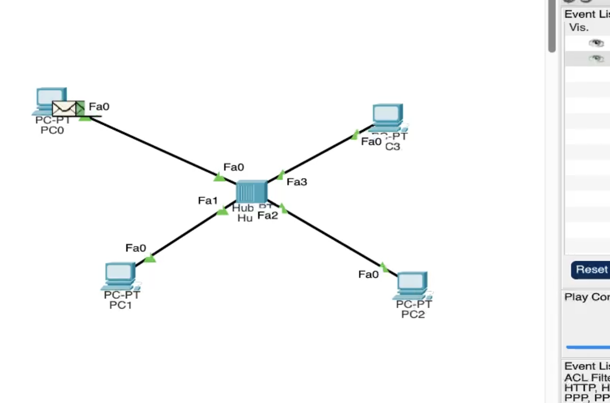
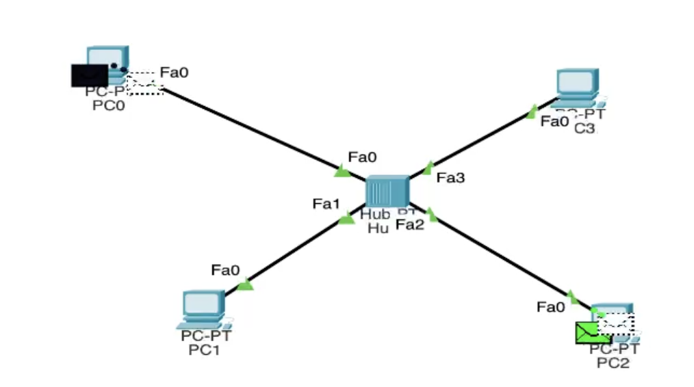
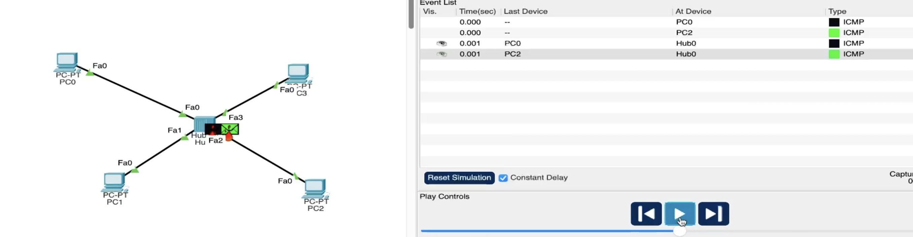
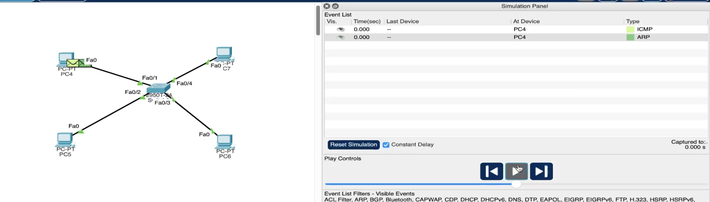
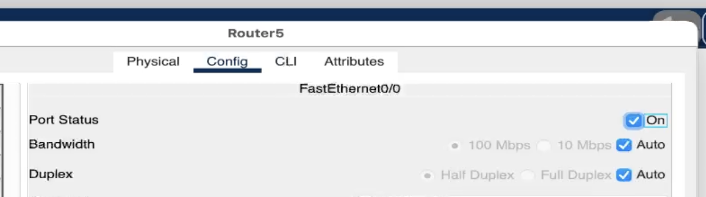

---
## Front matter
lang: ru-RU
title: Защита по лабораторной работе №1
subtitle: pf
author:
  - Чесноков Артемий Павлович
institute:
  - Российский университет дружбы народов, Москва, Россия
date: 15 марта 2025

## i18n babel
babel-lang: russian
babel-otherlangs: english

## Formatting pdf
toc: false
toc-title: Содержание
slide_level: 2
aspectratio: 169
section-titles: true
theme: metropolis
header-includes:
 - \metroset{progressbar=frametitle,sectionpage=progressbar,numbering=fraction}
---

# Информация

## Цель

Получить навыки работы с физической рабочей областью Packet Tracer,
а также учесть физические параметры сети.

## Заходим на networkAcademy .

## Строим схему с концентратором  .

## Указываем статические адреса на устройствах  .

## Запускаем симуляцию и отправляем с PC0 на PC4 .

## Информация о PDU: уровень OSI .

## Информация о PDU: форматы пакетов .

## Как нас и попросили проверяем себя в тесте  .

## Отправляем с двух сторон пакеты  .

## Отслеживаем пакеты  .

## Размещаем коммутатор   .

## Запустив пакеты замечаем разницу в передаче .

## Рассматриваем пакеты .

## Соединяем наши схемы .

## Отправляем пакет от устройства левой схемы на устройство правой  .

## Добавляем маршрутизатор .

## Прописываем статический адрес .

## Устанавливаем тоггл в On на открытие портов  .

## Спасибо за внимание.
