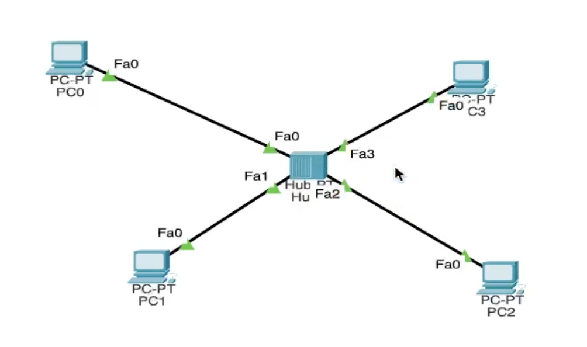
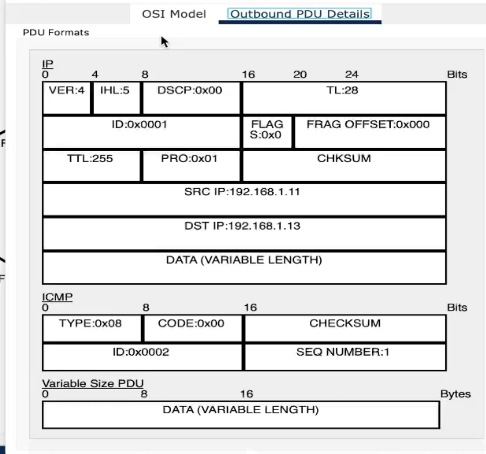

--
## Front matter
lang: ru-RU
title: Лабораторная работа №5
subtitle: Конфигурирование VLAN"
author:
  - Хрусталев В.Н.
institute:
  - Российский университет дружбы народов, Москва, Россия

## i18n babel
babel-lang: russian
babel-otherlangs: english

## Formatting pdf
toc: false
toc-title: Содержание
slide_level: 2
aspectratio: 169
section-titles: true
theme: metropolis
header-includes:
 - \metroset{progressbar=frametitle,sectionpage=progressbar,numbering=fraction}
--

# Информация

## Цель работы

Получить основные навыки по настройке VLAN на комуникаторах сети.

## Задание

1. На коммутаторах сети настроить Trunk-порты на соответствующих интерфейсах, связывающих коммутаторы между собой.
2. Коммутатор msk-donskaya-sw-1 настроить как VTP-сервер и прописать на
нём номера и названия VLAN.
3. Коммутаторы msk-donskaya-sw-2 — msk-donskaya-sw-4, msk-pavlovskaya-sw-1 настроить как VTP-клиенты, на интерфейсах указать
принадлежность к соответствующему VLAN.
4. На серверах прописать IP-адреса.
5. На оконечных устройствах указать соответствующий адрес шлюза и прописать статические IP-адреса из диапазона соответствующей сети, следуя регламенту выделения ip-адресов.
6. Проверить доступность устройств, принадлежащих одному VLAN, и недоступность устройств, принадлежащих разным VLAN.
7. При выполнении работы необходимо учитывать соглашение об именовании.

## Настройка Trunk-порта на msk-donskaya-vnkhrustalev-sw-1

{#fig:001 width=70%}

## Настройка Trunk-порта на msk-donskaya-vnkhrustalev-sw-2

{#fig:002 width=70%}

## Настройка Trunk-порта на msk-donskaya-vnkhrustalev-sw-3

{#fig:003 width=70%}

## Настройка Trunk-порта на msk-donskaya-vnkhrustalev-sw-4

{#fig:004 width=70%}

## Настройка Trunk-порта на msk-donskaya-vnkhrustalev-sw-1 (повторное)

{#fig:005 width=70%}

## Настройка Trunk-порта на msk-pavlovskaya-vnkhrustalev-sw-1

{#fig:006 width=70%}

## Настройка коммутатора msk-donskaya-vnkhrustalev-sw-1 как VTP-сервер

{#fig:007 width=70%}

## Настройка коммутатора msk-donskaya-vnkhrustalev-sw-2 как VTP-клиент

{#fig:008 width=70%}

## Настройка коммутатора msk-donskaya-vnkhrustalev-sw-3 как VTP-клиент

{#fig:009 width=70%}

## Настройка коммутатора msk-donskaya-vnkhrustalev-sw-4 как VTP-клиент

{#fig:010 width=70%}

## Настройка коммутатора msk-pavlovskaya-vnkhrustalev-sw-1 как VTP-клиент

{#fig:011 width=70%}

## Задание IP-адреса шлюза

{#fig:012 width=70%}

## Задание IP-адреса

{#fig:013 width=70%}

## Проверка доступности устройств в одном VLAN

{#fig:014 width=70%}

## Режим симуляции (успешно)

{#fig:015 width=70%}

## Информация о PDU

{#fig:016 width=70%}

## Режим симуляции (неудачно)

{#fig:017 width=70%}

## Вывод

В ходе выполнения лабораторной работы мы получили основные навыки по настройке VLAN на коммутаторах сети.
