---
## Front matter
lang: ru-RU
title: Защита по лабораторной работе №2
subtitle: pf
author:
  - Чесноков Артемий Павлович
institute:
  - Российский университет дружбы народов, Москва, Россия
date: 15 марта 2025

## i18n babel
babel-lang: russian
babel-otherlangs: english

## Formatting pdf
toc: false
toc-title: Содержание
slide_level: 2
aspectratio: 169
section-titles: true
theme: metropolis
header-includes:
 - \metroset{progressbar=frametitle,sectionpage=progressbar,numbering=fraction}
---

# Информация

## Цель

Получить основные навыки по начальному конфигурированию оборудования
Cisco.

## Строим схему с маршрутизатором .

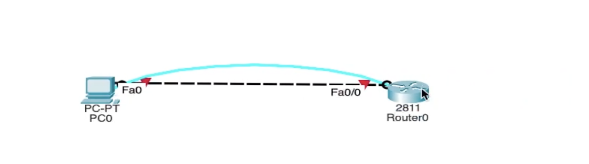

## Конфигурируем маршрутизатор  .

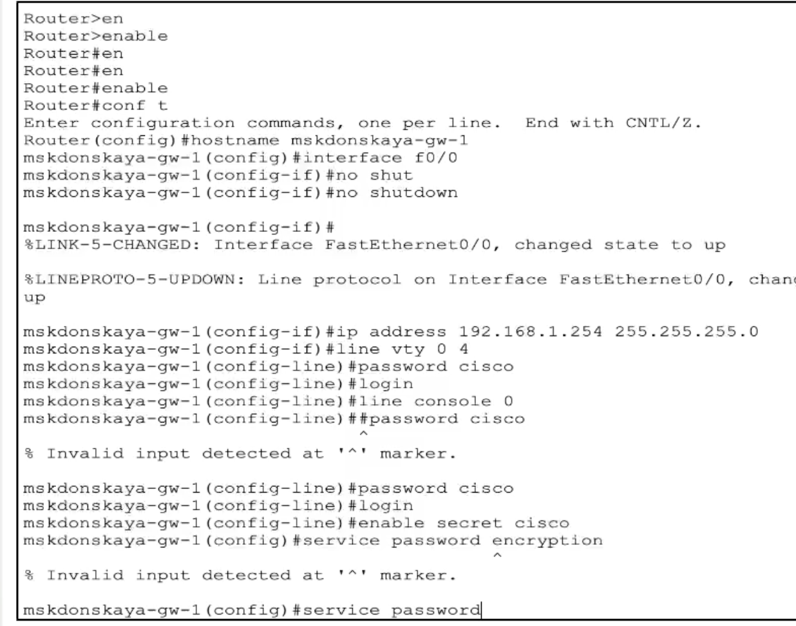

## Продолжение  .

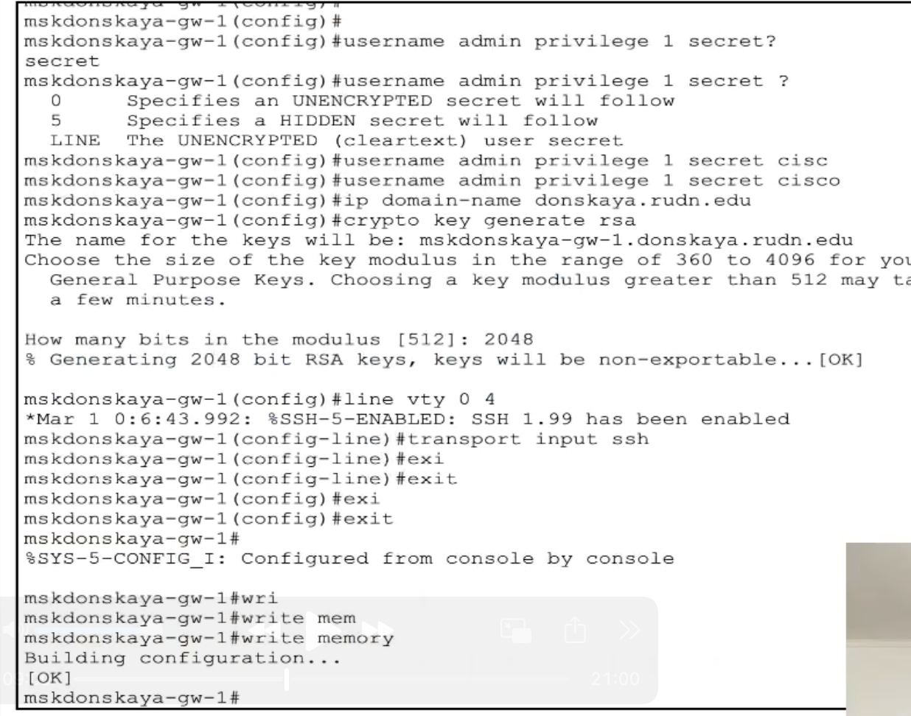

## Строим схему с коммутатором .

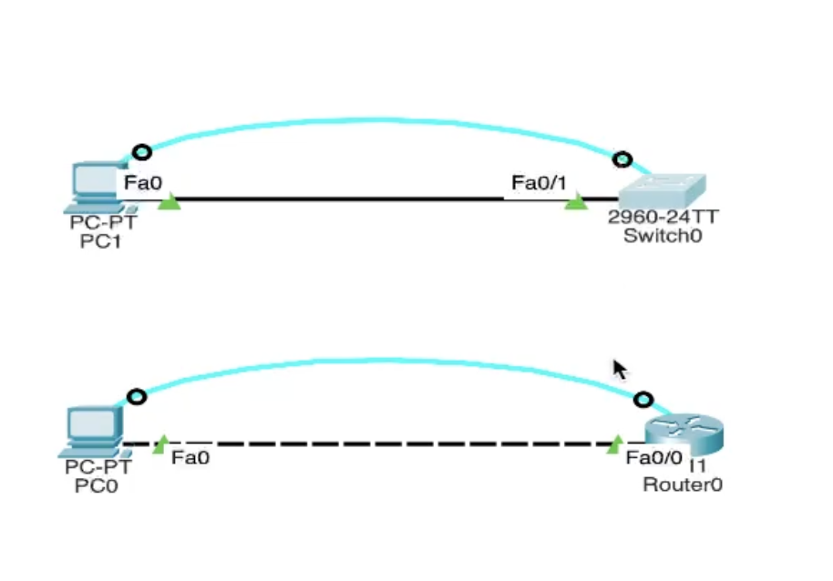

## конфигурируем коммутатор .

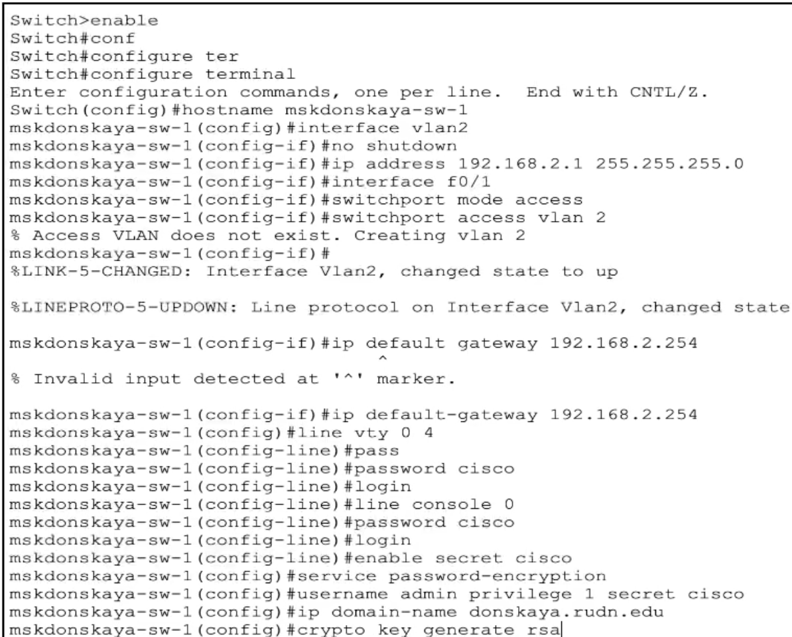

## Информация о PDU: форматы пакетов .

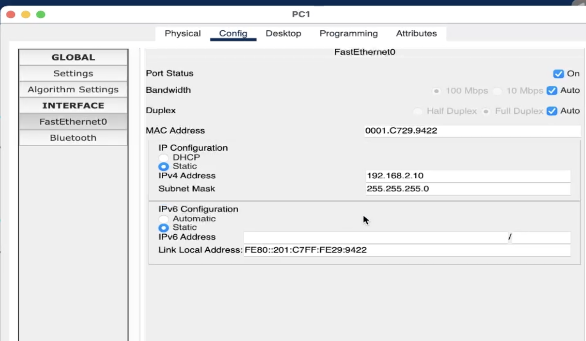

## Второе устройство  .

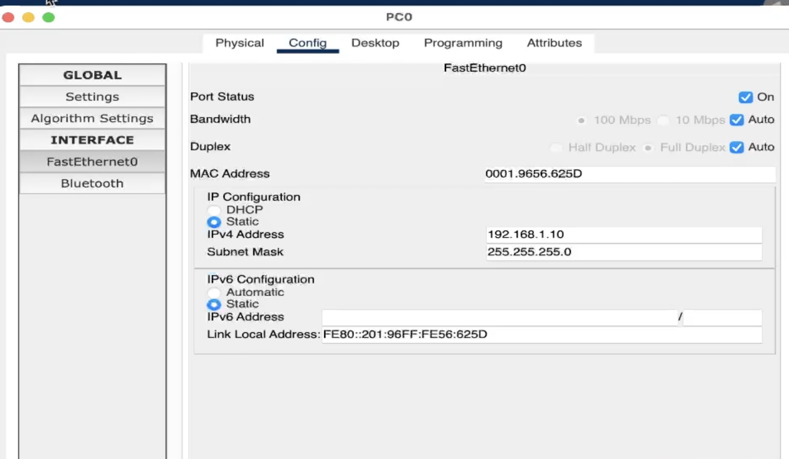

## В PC-1 открываем командную консоль  .

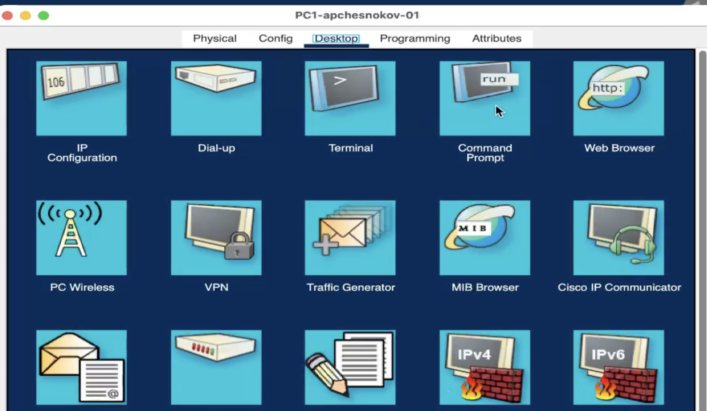

## Пингуем  .

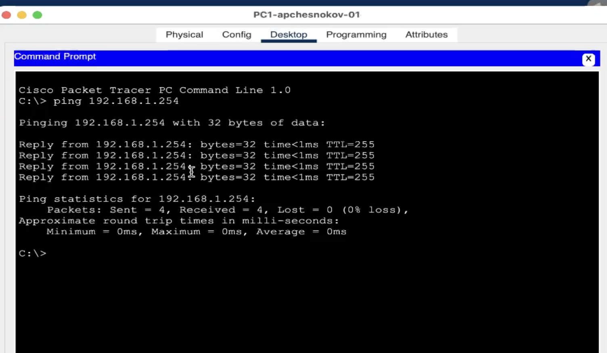

## Подключаемся по ssh   .

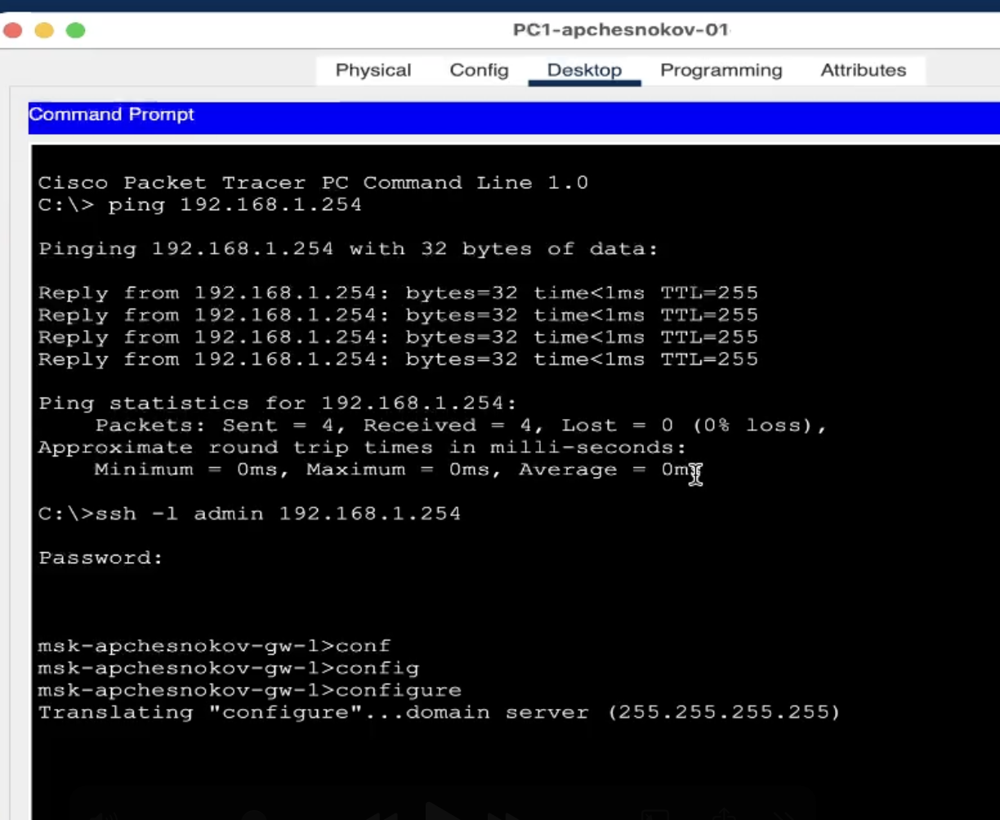

## Аналогично стучимся к коммутатору .

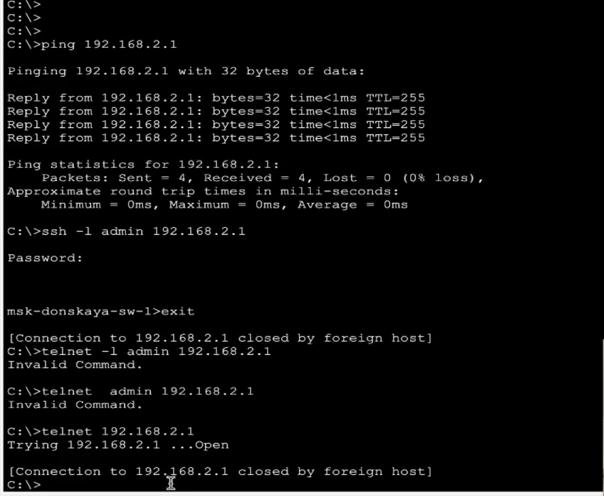

## Спасибо за внимание.
