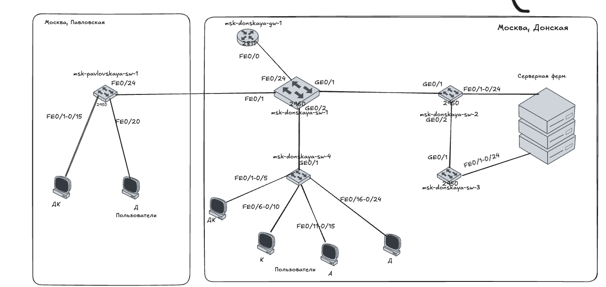
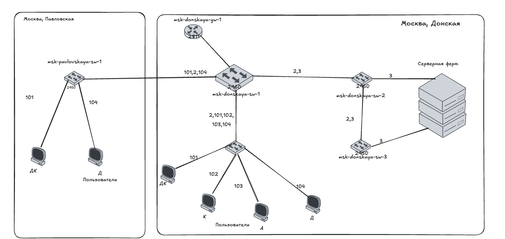
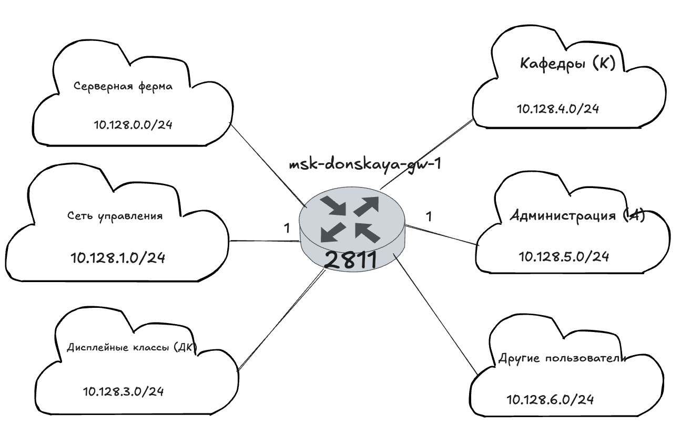
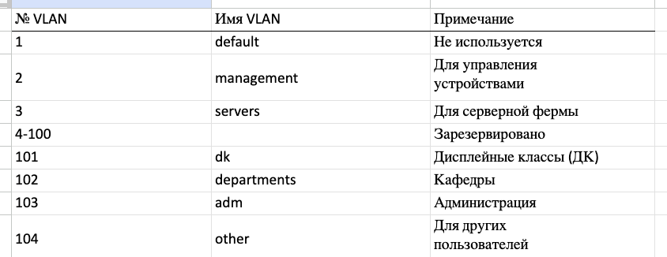
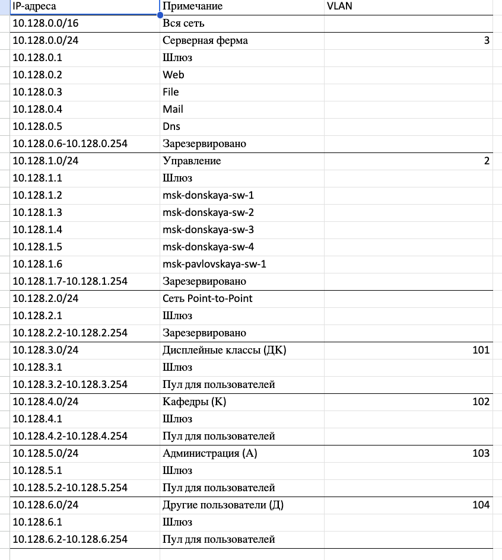
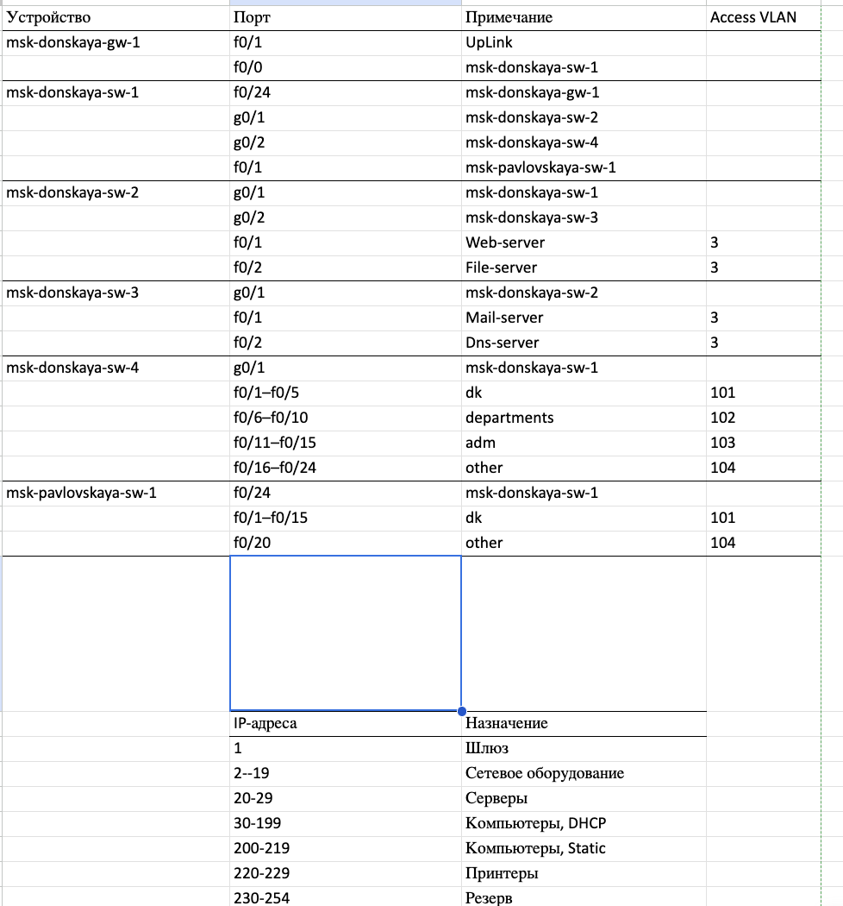
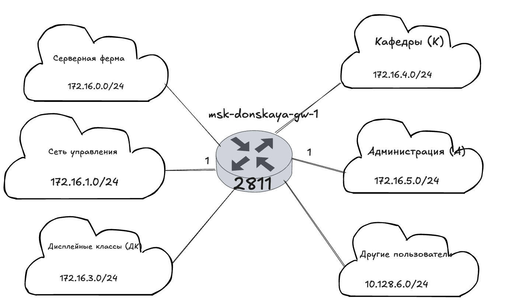
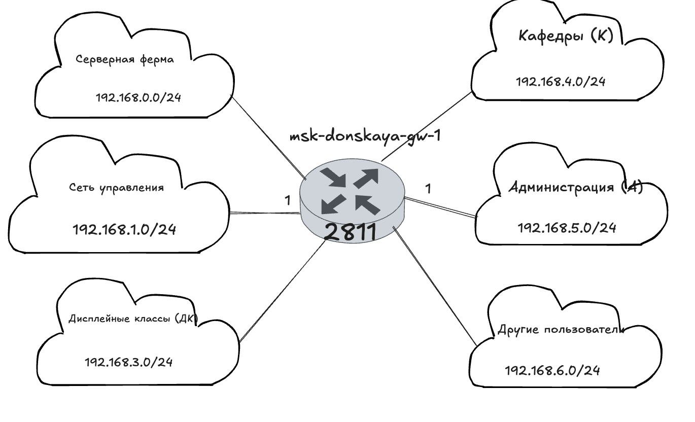
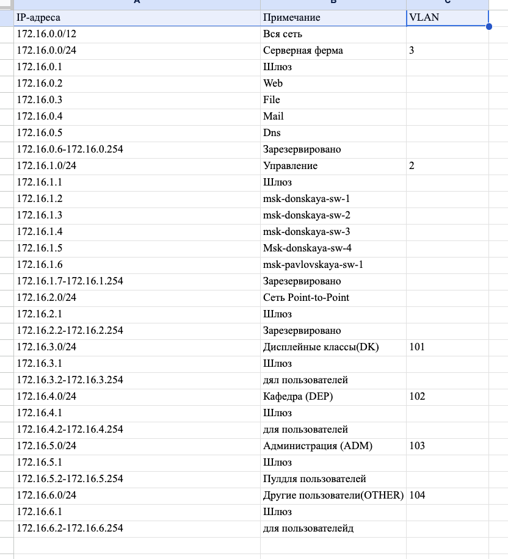
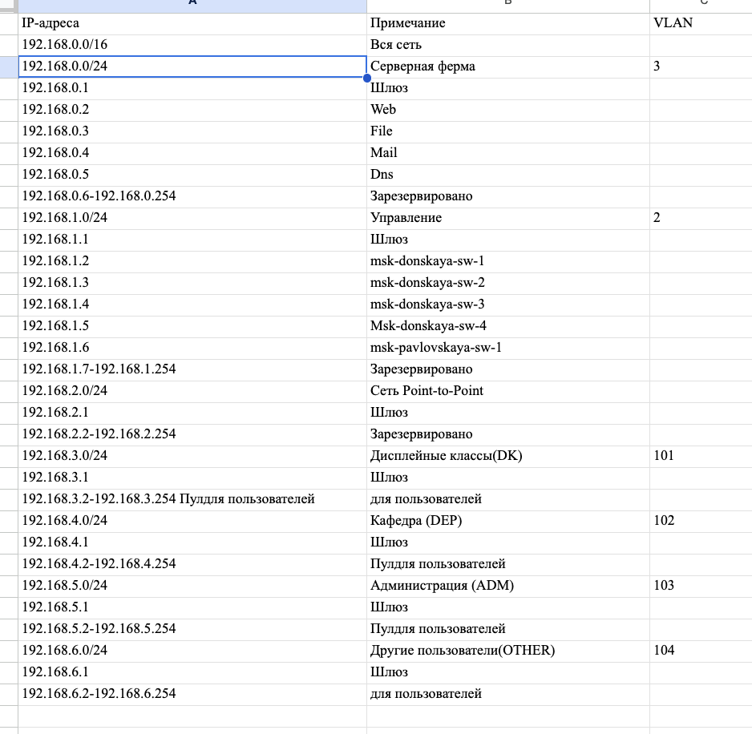

---
## Front matter
lang: ru-RU
title: Защита по лабораторной работе №3
subtitle: pf
author:
  - Чесноков Артемий Павлович
institute:
  - Российский университет дружбы народов, Москва, Россия
date: 15 марта 2025

## i18n babel
babel-lang: russian
babel-otherlangs: english

## Formatting pdf
toc: false
toc-title: Содержание
slide_level: 2
aspectratio: 169
section-titles: true
theme: metropolis
header-includes:
 - \metroset{progressbar=frametitle,sectionpage=progressbar,numbering=fraction}
---

# Информация

## Цель

Познакомится с принципами планирования локальной сети организации.

## Повторяем схему первого слоя в нашей системе .

## Повторяем схему распределения VLAN  .

## Повторяем схему маршрутизации  .

## Повторяем таблицу VLAN'ов, ознакамливаемся .

## Повторяем таблицу IP адресов, ознакамливаемся .

## Повторяем таблицу портов, ознакамливаемся .

## Делаем схему маршрутизации для 176.16.0.0/12  .

## Таблицы для IP адресов для 176.16.0.0/12  .

## Делаем схему маршрутизации для 192.168.0.0/16 .

## Таблицы для IP адресов для 192.168.0.0/16  .

## Спасибо за внимание.
