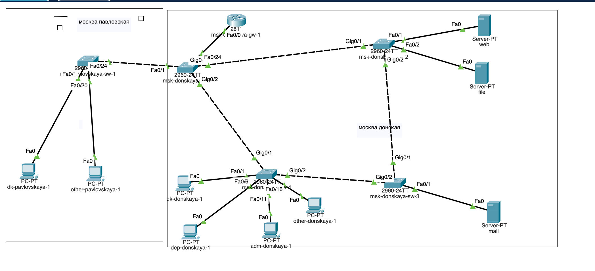
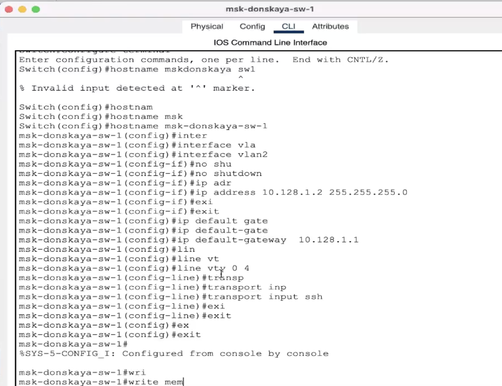
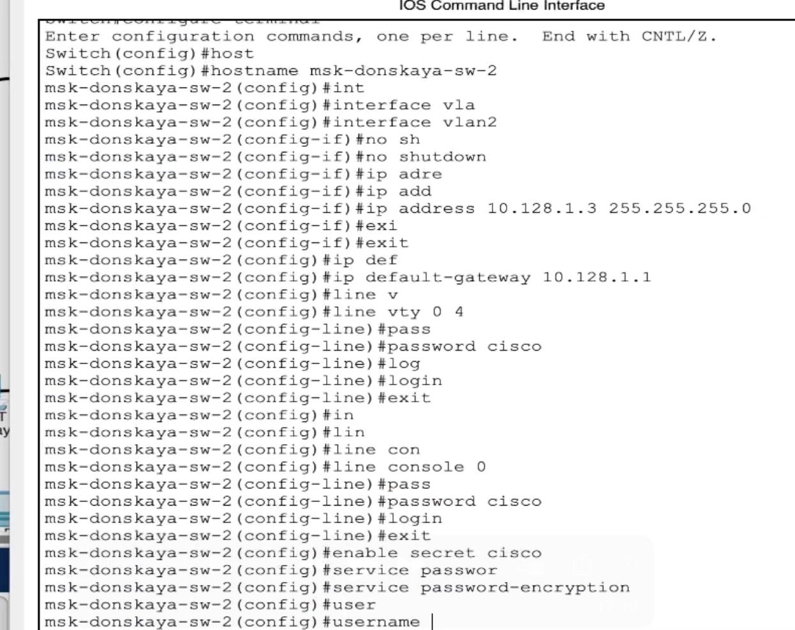
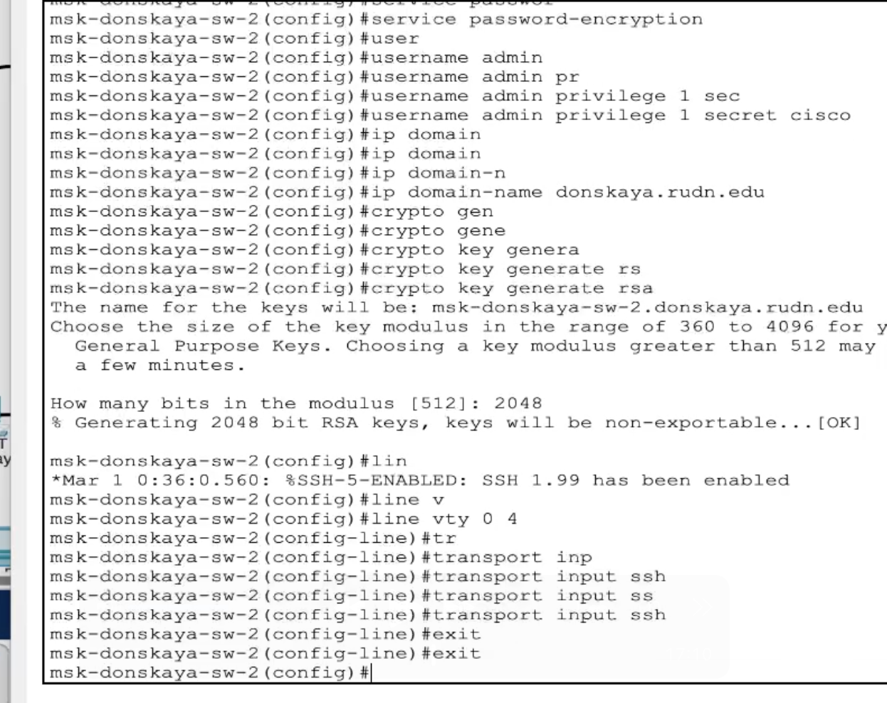
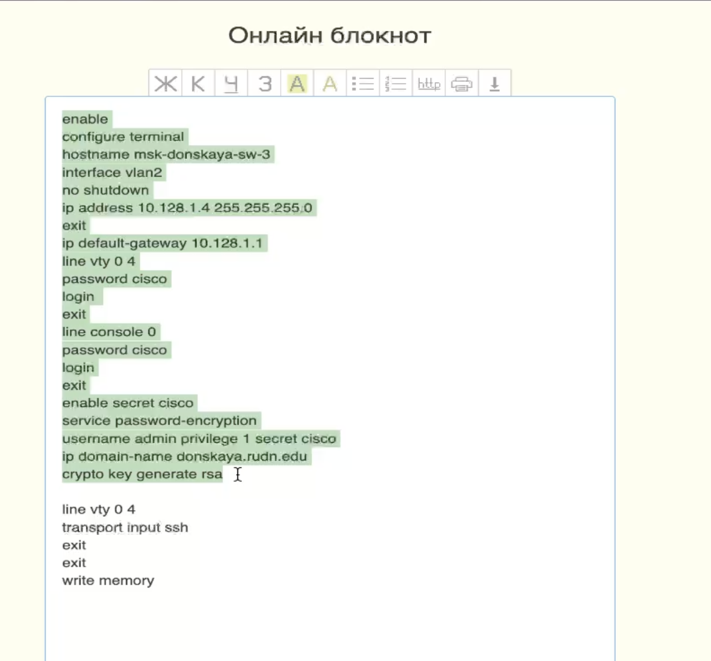
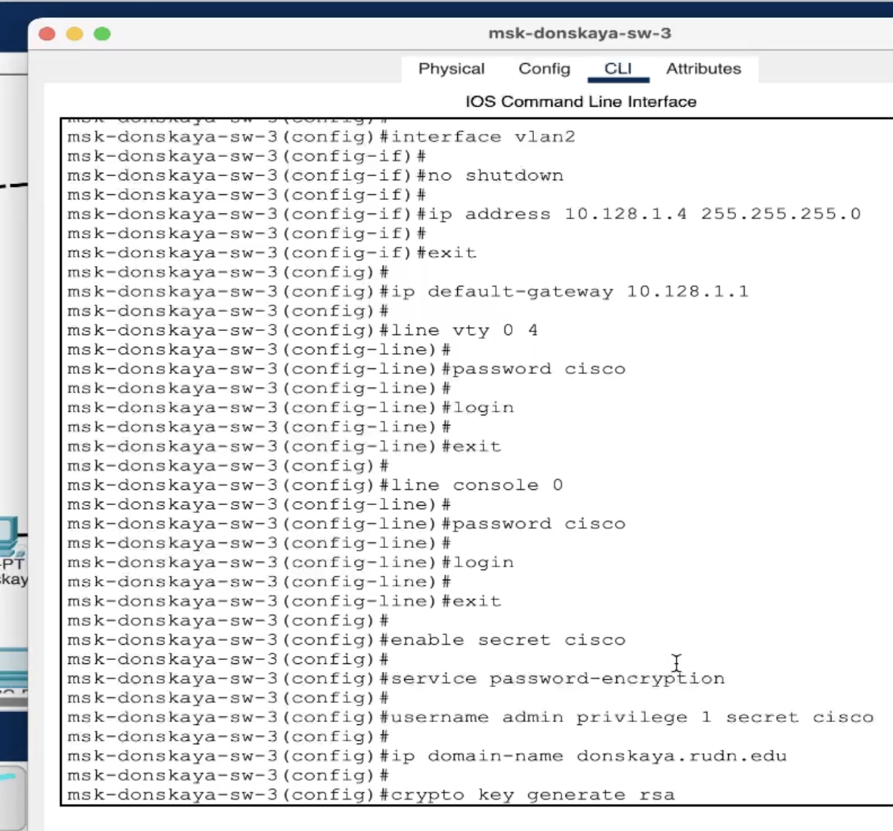
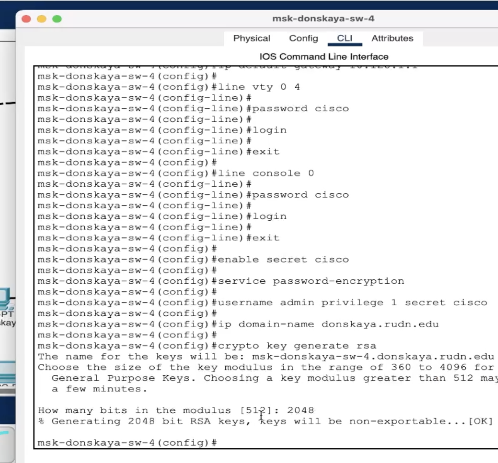
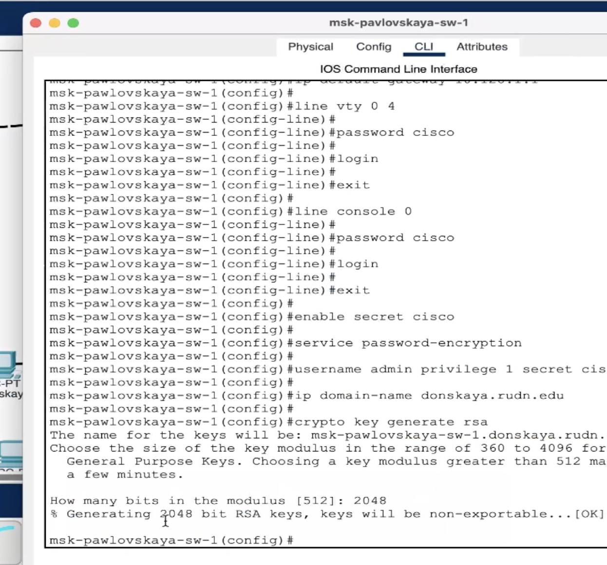

---
## Front matter
lang: ru-RU
title: Защита по лабораторной работе №4
subtitle: pf
author:
  - Чесноков Артемий Павлович
institute:
  - Российский университет дружбы народов, Москва, Россия
date: 15 марта 2025

## i18n babel
babel-lang: russian
babel-otherlangs: english

## Formatting pdf
toc: false
toc-title: Содержание
slide_level: 2
aspectratio: 169
section-titles: true
theme: metropolis
header-includes:
 - \metroset{progressbar=frametitle,sectionpage=progressbar,numbering=fraction}
---

# Информация

## Цель

Провести подготовительную работу по первоначальной настройке коммутаторов сети.

## Строим сеть .

## Настраиваем все коммутаторы, изменяя название устройства в соответствии с соглашением об именовании  .

## Продолжение конфигурации  .

## Продолжение конфигурации .

## В целях экономии времени переписываем все команды на блокнот и для каждого коммутатора просто вставляем нужное имя и адрес  .

## Для третьего .

## Для четвертого  .

## Для второго  .

## Спасибо за внимание.
