---
## Front matter
lang: ru-RU
title: Защита по лабораторной работе №5
subtitle: Простейший шаблон
author:
  - Чесноков Артемий Павлович
institute:
  - Российский университет дружбы народов, Москва, Россия
date: 15 марта 2025

## i18n babel
babel-lang: russian
babel-otherlangs: english

## Formatting pdf
toc: false
toc-title: Содержание
slide_level: 2
aspectratio: 169
section-titles: true
theme: metropolis
header-includes:
 - \metroset{progressbar=frametitle,sectionpage=progressbar,numbering=fraction}
---

# Информация

## Цель

- Получить основные навыки по настройке VLAN на коммутаторах сети.

## Настраиваем trunk порты (рис. @fig:001).

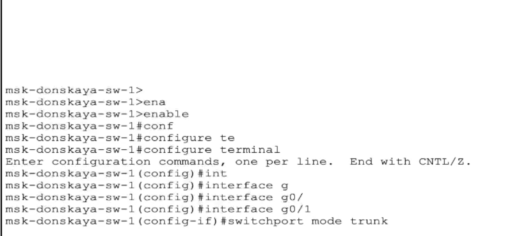{#fig:001 width=70%}

## Настраиваем маршрутизатор-сервер  (рис. @fig:002).

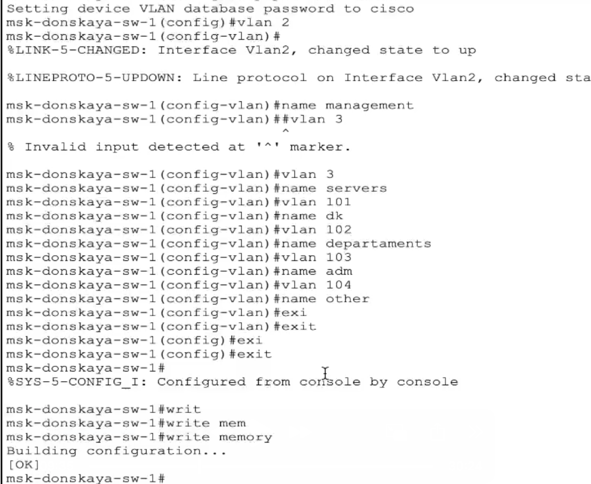{#fig:002 width=70%}

## Показываем результат списком  (рис. @fig:003).

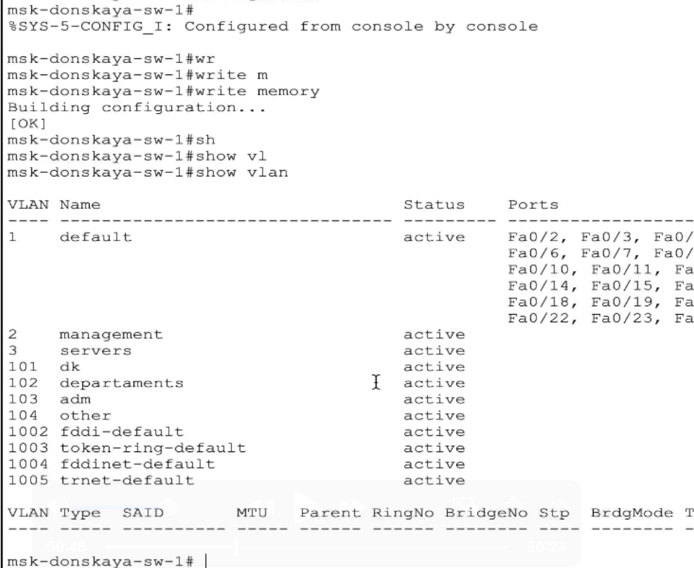{#fig:003 width=70%}

## Закрепляем остальные маршрутизаторы как клиенты  (рис. @fig:004).

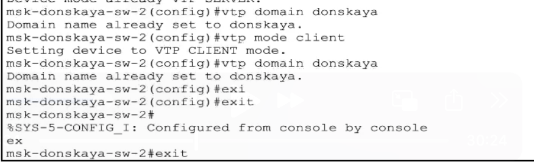{#fig:004 width=70%}

## Список для четвертого маршрутизатора  (рис. @fig:005).

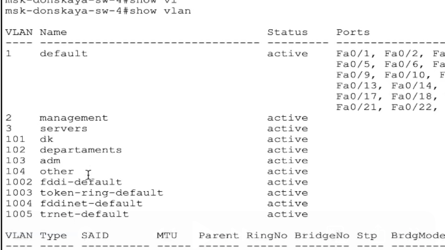{#fig:005 width=70%}

## Прописываем диапазоны (рис. @fig:006).

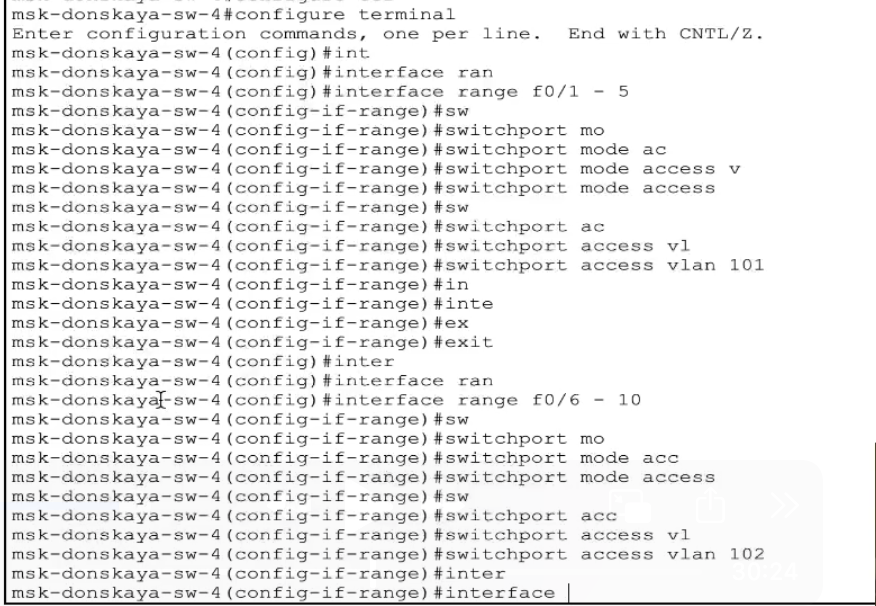{#fig:006 width=70%}

## Проставляем статические IP адреса на конечные устройства  (рис. @fig:007).

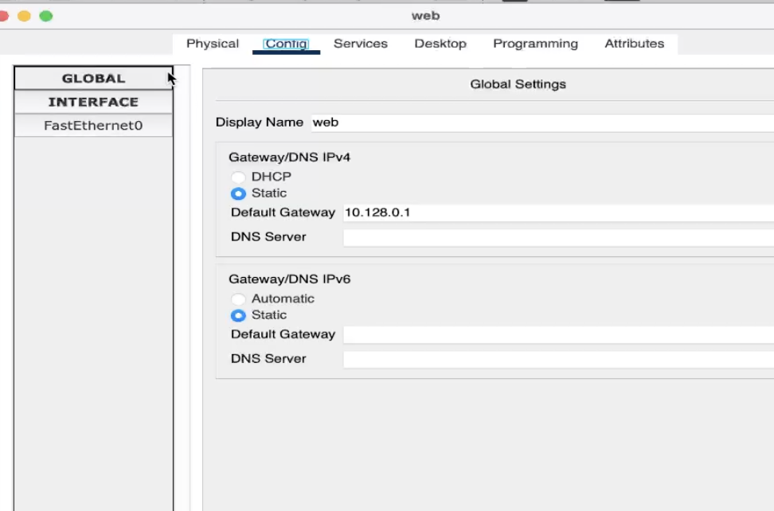{#fig:007 width=70%}

## Открываем командную строку на донском и пингуем павловскую  (рис. @fig:008).

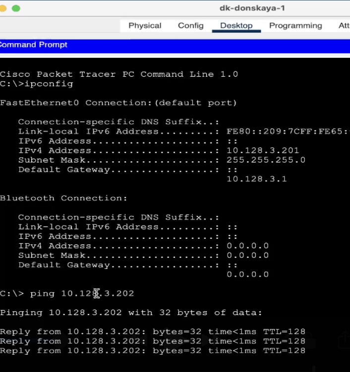{#fig:008 width=70%}

## Включаем симуляцию и отслеживаем ICMP протокол (рис. @fig:009).

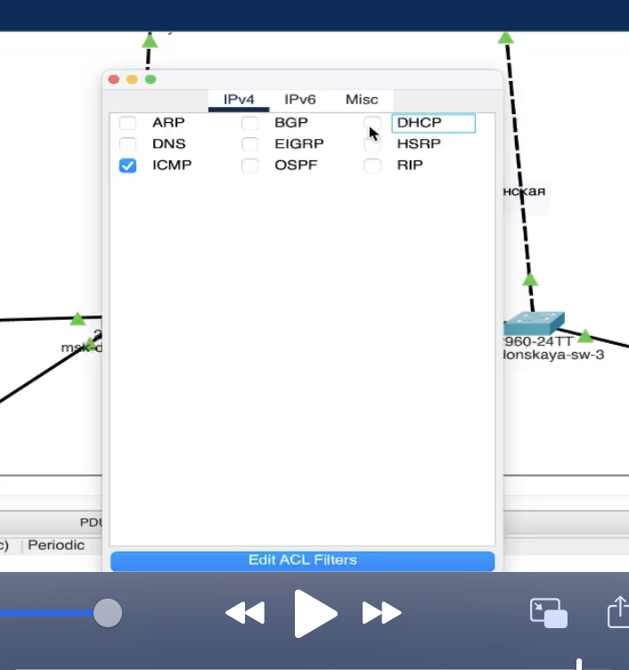{#fig:009 width=70%}

## Отправляем  (рис. @fig:010).

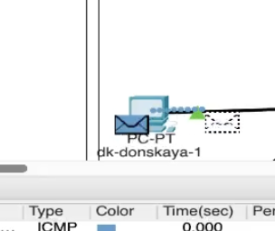{#fig:010 width=70%}

## Получаем   (рис. @fig:011).

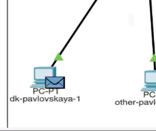{#fig:011 width=70%}

## Наблюдаем передоваемую информацию  (рис. @fig:012).

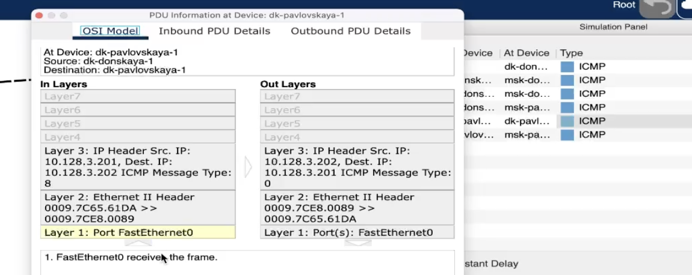{#fig:012 width=70%}

## Спасибо за внимание.
