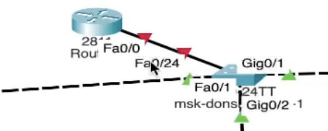
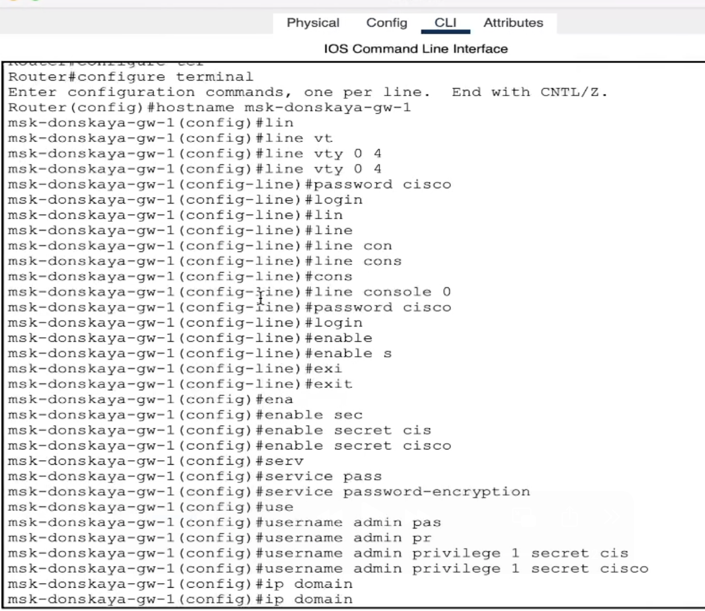
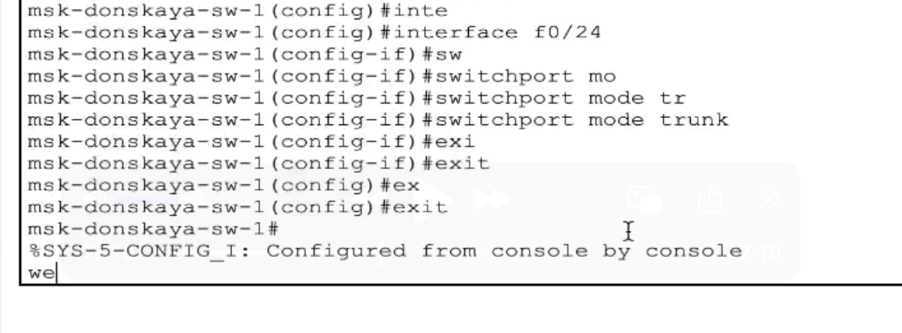
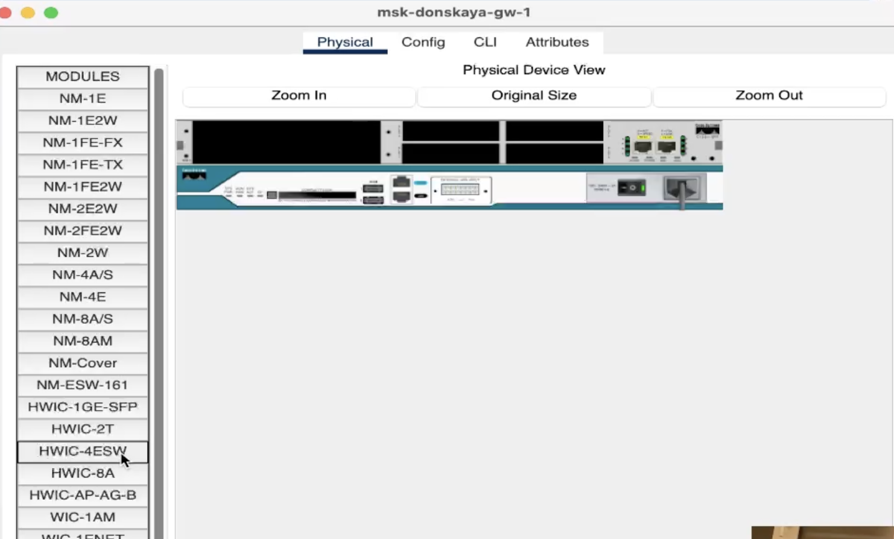
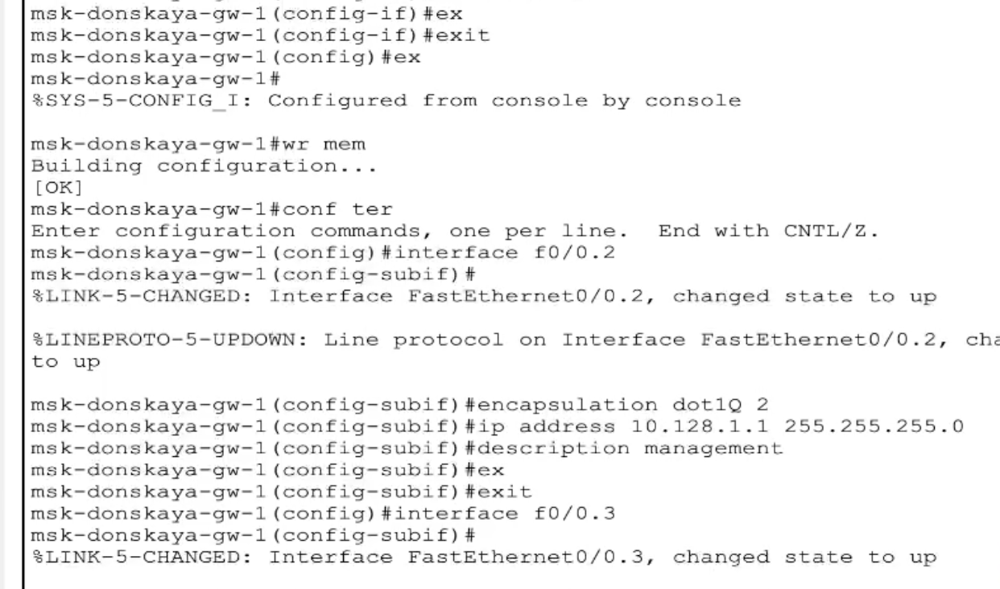
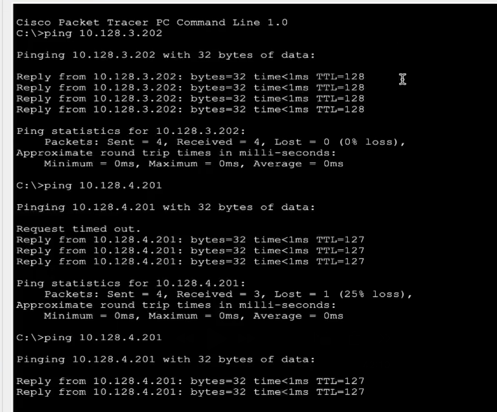
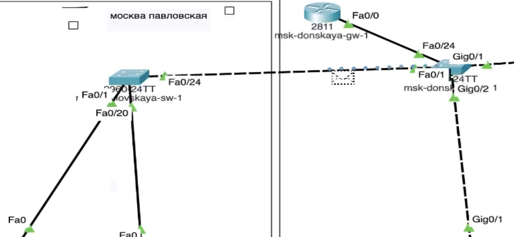

---
## Front matter
lang: ru-RU
title: Защита по лабораторной работе №6
subtitle: pf
author:
  - Чесноков Артемий Павлович
institute:
  - Российский университет дружбы народов, Москва, Россия
date: 15 марта 2025

## i18n babel
babel-lang: russian
babel-otherlangs: english

## Formatting pdf
toc: false
toc-title: Содержание
slide_level: 2
aspectratio: 169
section-titles: true
theme: metropolis
header-includes:
 - \metroset{progressbar=frametitle,sectionpage=progressbar,numbering=fraction}
---

# Информация

## Цель

- Настроить статическую маршрутизацию VLAN в сети.

## Добаляем в локальную сеть маршрутизатор .

## Первоначальная конфигурация поставленного маршрутизатора  .

## Настраиваем порт 24 коммутатора msk-donskaya-sw-1 как trunk-порт  .

## Добавляем порты .

## Настраиваем все виртуальные интерфейсы  .

## Пингуем .

## Симулируем запро  .

## Спасибо за внимание.
