---
## Front matter
lang: ru-RU
title: Защита по лабораторной работе №7
subtitle: pf
author:
  - Чесноков Артемий Павлович
institute:
  - Российский университет дружбы народов, Москва, Россия
date: 15 марта 2025

## i18n babel
babel-lang: russian
babel-otherlangs: english

## Formatting pdf
toc: false
toc-title: Содержание
slide_level: 2
aspectratio: 169
section-titles: true
theme: metropolis
header-includes:
 - \metroset{progressbar=frametitle,sectionpage=progressbar,numbering=fraction}
---

# Информация

## Цель

Получить навыки работы с физической рабочей областью Packet Tracer,
а также учесть физические параметры сети.

## Give the name to the city .

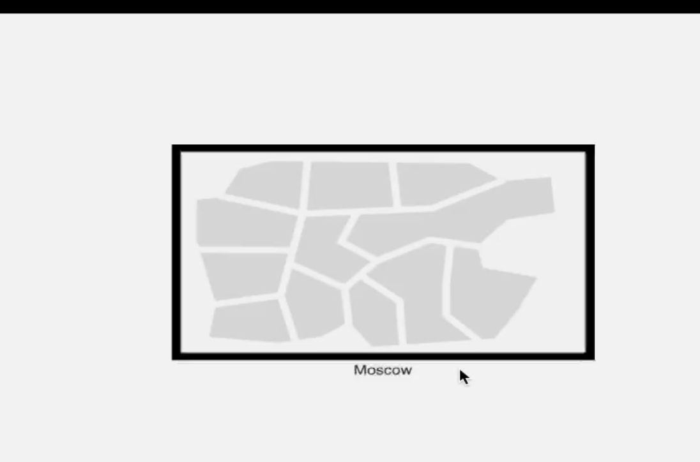

## Add buildings  .

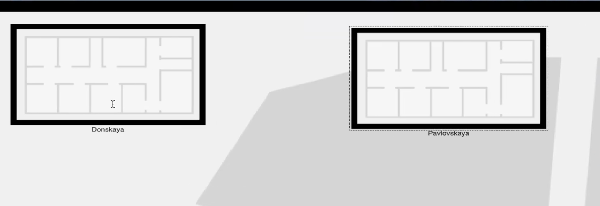

## We move the switches and other devices in physical education  .

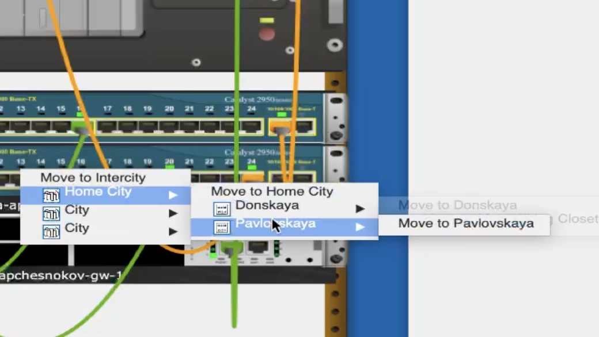

## We check the operability of the connection .

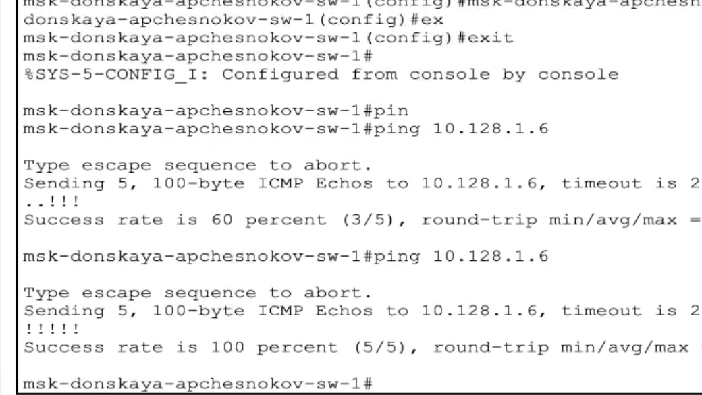

## We turn on the influence of the length of the cable on our network .

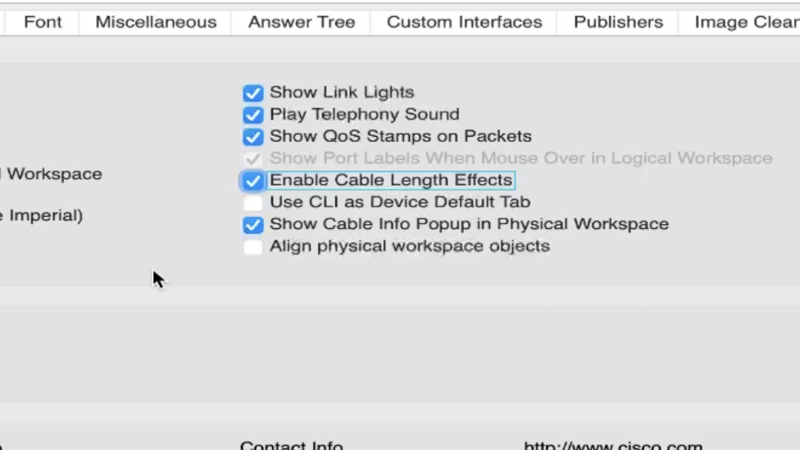

## Physically place buildings at a distance> 1000m .

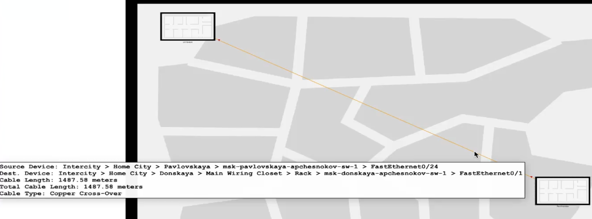

## Remove the cable, put the repeaters  .

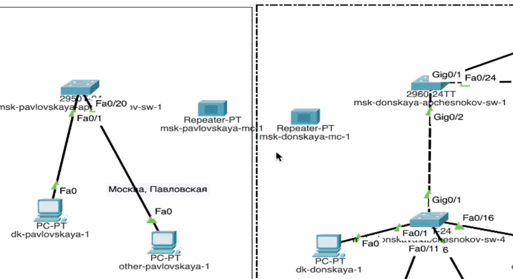

## We replace the modules  .

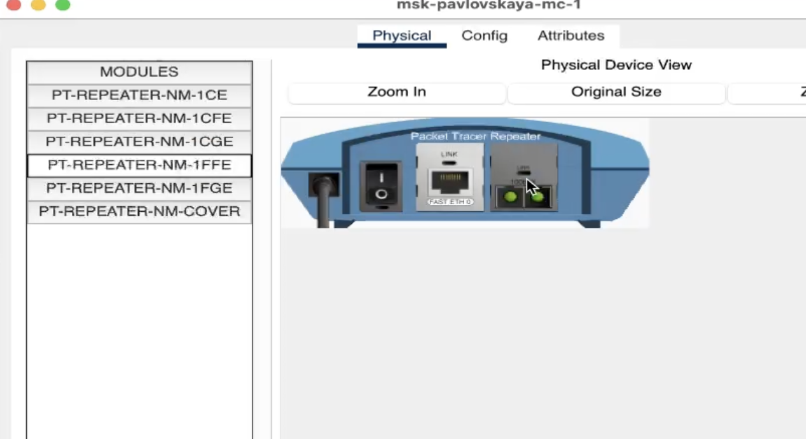

## We transfer its repeater to Pavlovskaya  .

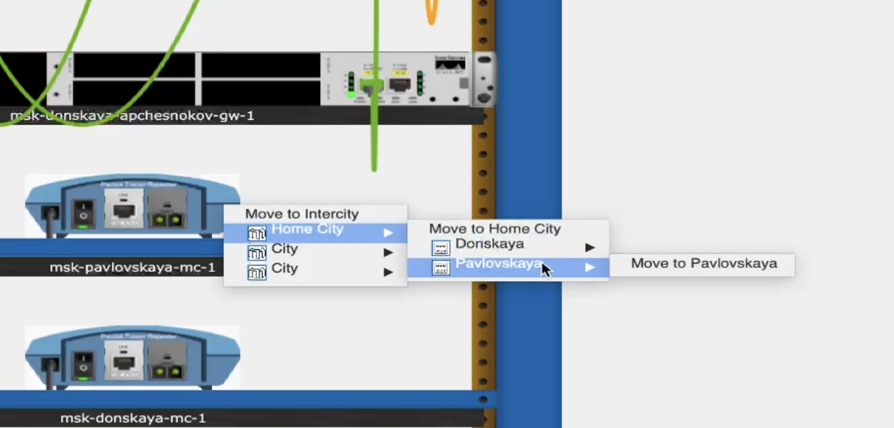

## Connect  .

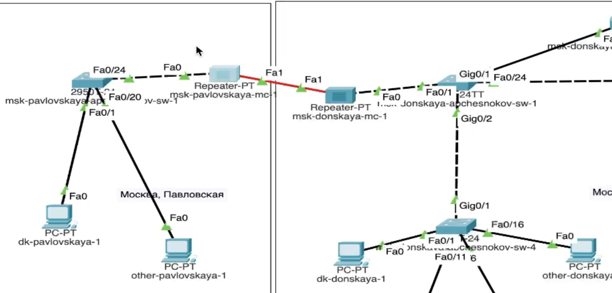

## We check the operability of the connection  .

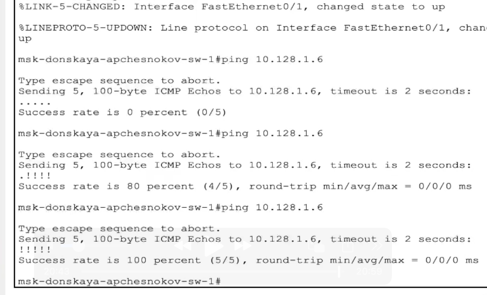

## Спасибо за внимание.
