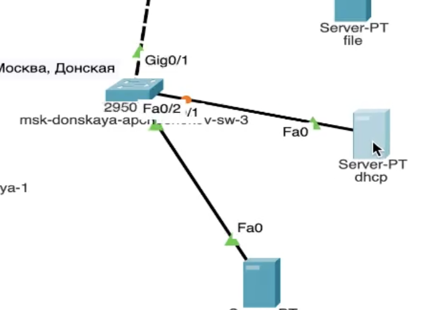
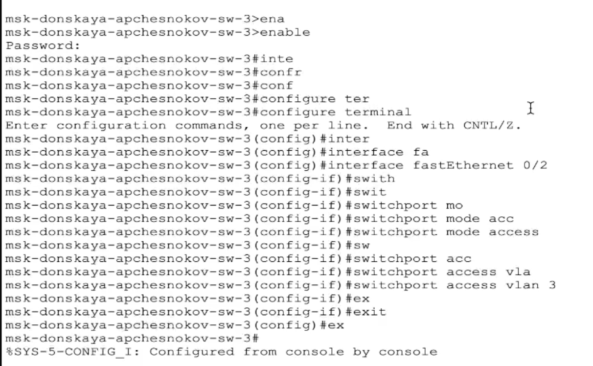
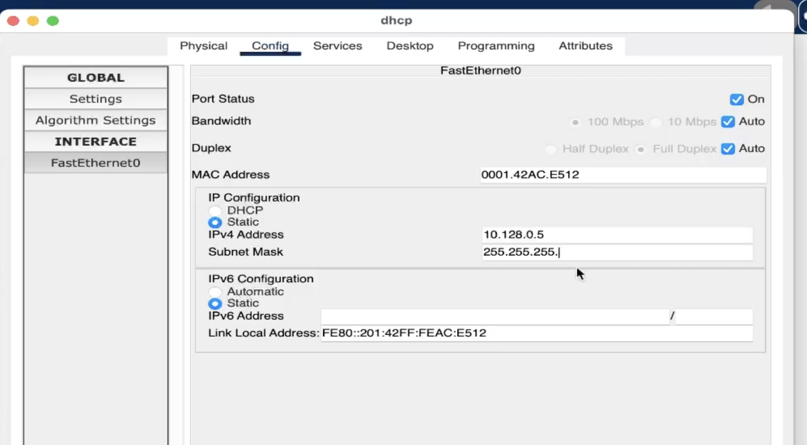
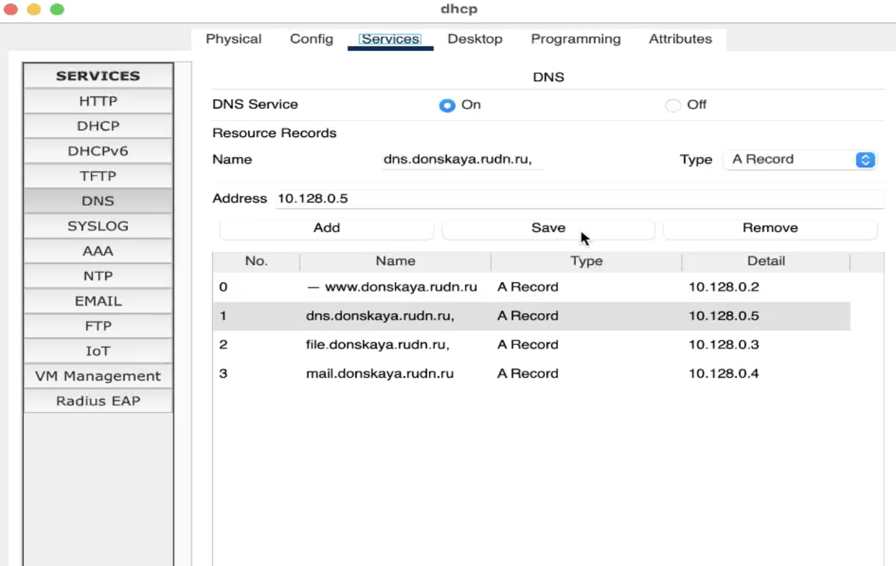
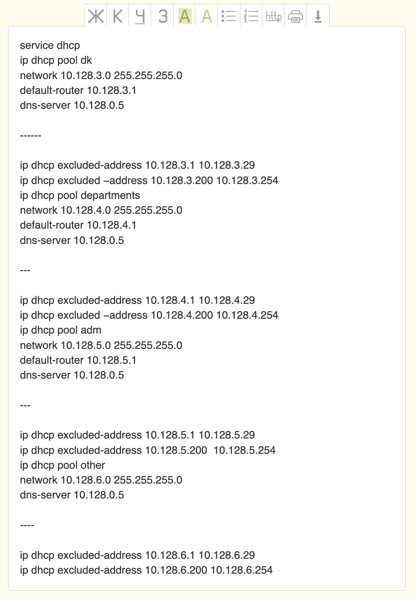
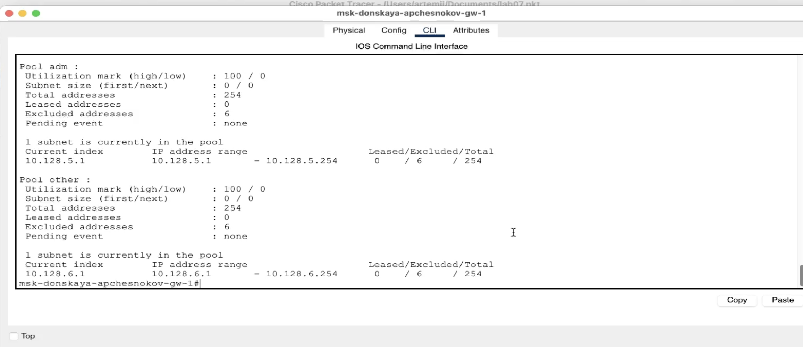
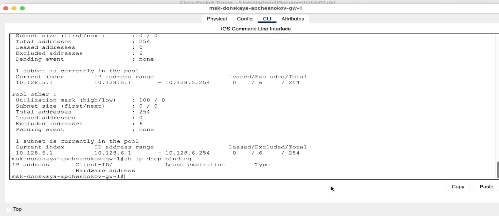
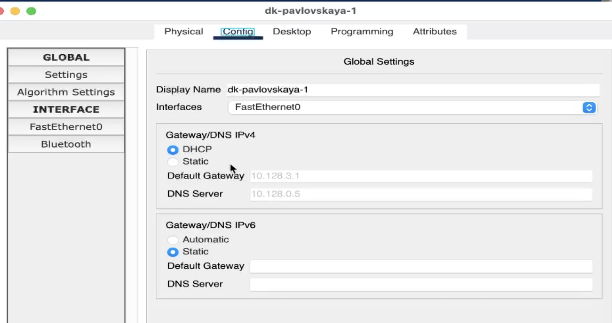
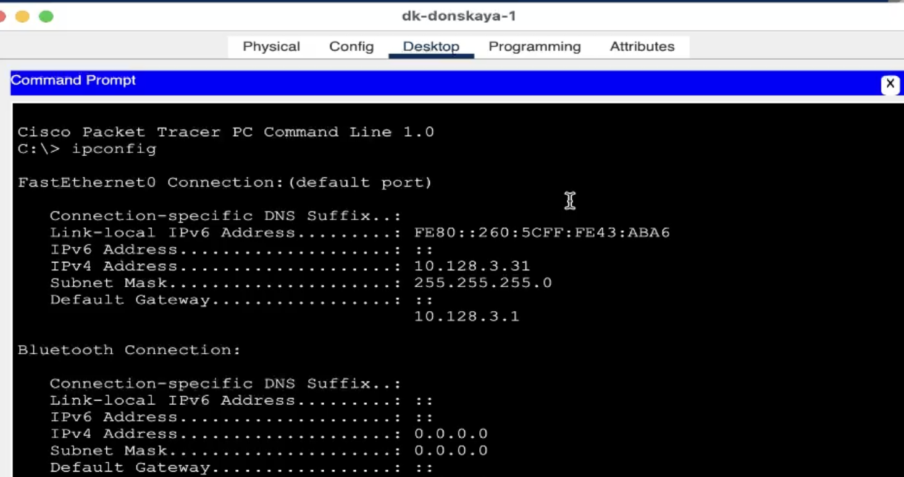
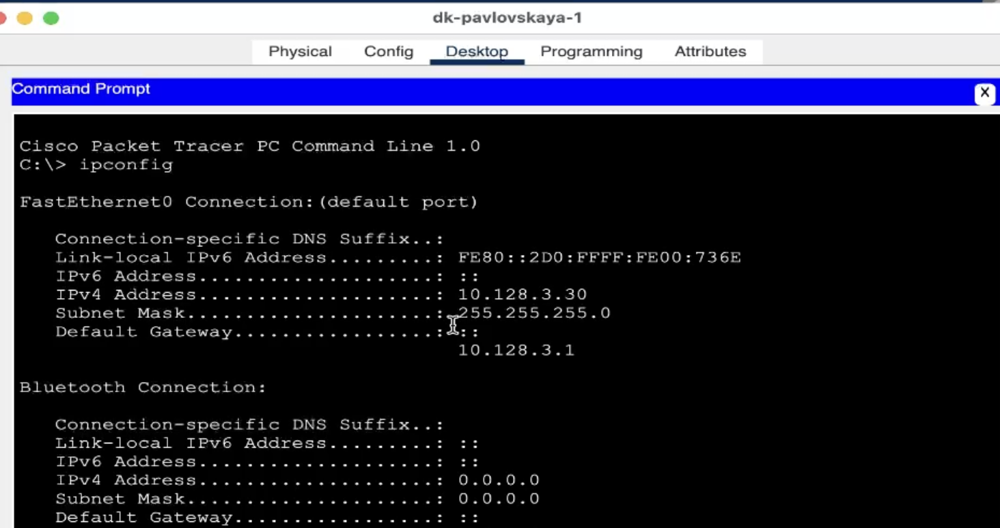

---
## Front matter
lang: ru-RU
title: Защита по лабораторной работе №3
subtitle: pf
author:
  - Чесноков Артемий Павлович
institute:
  - Российский университет дружбы народов, Москва, Россия
date: 15 марта 2025

## i18n babel
babel-lang: russian
babel-otherlangs: english

## Formatting pdf
toc: false
toc-title: Содержание
slide_level: 2
aspectratio: 169
section-titles: true
theme: metropolis
header-includes:
 - \metroset{progressbar=frametitle,sectionpage=progressbar,numbering=fraction}
---

# Информация

## Цель

Приобретение практических навыков по настройке динамического распределения IP-адресов посредством протокола DHCP (Dynamic Host Configuration
Protocol) [5] в локальной сети.

## Разместим и подключим сервер .

## Подключаем коммутатор и активируем порт  .

## Присваиваем статический адрес  .

## Настроим сервис DNS по нашим нуждам .

## В целях экономии времени переписываем все команды на блокнот и вставляем в наш маршрутизатор .

## Информация о пулах DHCP .

## Информация об привязках выданных адресов  .

## Меняем всем устройствам статическую адресацию на динамическую .

## Наблюдаем за присвоением адреса ДК на донской .

## Наблюдаем за присвоением адреса ДК на павловской   .

## Отправляем тестовые пакеты  .

## В содержимом пакета наблюдаем конкретные значения адресов  .

## Спасибо за внимание.
