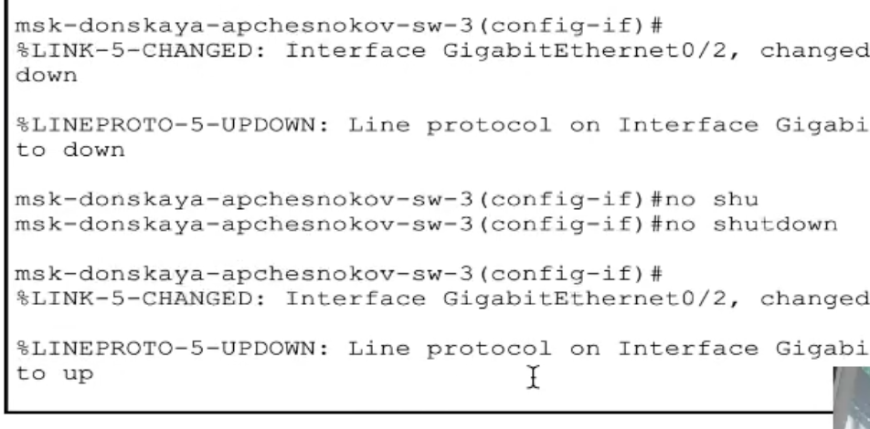

---
## Front matter
lang: ru-RU
title: Защита по лабораторной работе №9
subtitle: pf
author:
  - Чесноков Артемий Павлович
institute:
  - Российский университет дружбы народов, Москва, Россия
date: 15 марта 2025

## i18n babel
babel-lang: russian
babel-otherlangs: english

## Formatting pdf
toc: false
toc-title: Содержание
slide_level: 2
aspectratio: 169
section-titles: true
theme: metropolis
header-includes:
 - \metroset{progressbar=frametitle,sectionpage=progressbar,numbering=fraction}
---

# Информация

## Цель

Изучение возможностей протокола STP и его модификаций по обеспечению
отказоустойчивости сети, агрегированию интерфейсов и перераспределению
нагрузки между ними.

## Создаем  резервное соединение между коммутаторами msk-donskayasw-1 и msk-donskaya-sw-3 .

## Делаем транковый порты  .

## Соединяем коммутаторы 1 и 4  .

## Конфигурируем порты .

## проверяем работоспособность соединения .

## Отслеживаем только ICMP .

## В симуляции видим как пакет проходит через 2 коммутатор  .

## Наблюдаем что в STP протоколе второй коммутатор имеет статус корневого .

## Конфигурируем первый коммутатор .

## В симуляции видим, что от первого коммутатора запрос сразу переходит в 3   .

## Ставим portfast на каждый порт ведущий в сервер  .

##   .

## Будем продолжительное время пинговать mail сервер  .

## Отключаем путь по второму гигабитному порту  .

## Видим как пинг временно падает на время поиска нового маршрута  .

## Обратно поднимаем  .

## Так же смотрим пинг  .

## Ставим более современную версию, функционального наследника stp  .

## Повторям эксперимент с пингом  .

## Потери пакетов отсутствуют при опускании маршрута  .

## 1 пакет теряется при поднятии порта  .

## Формируем агрегированное соединение  .

## Отключаем транковые порты на обоих коммутаторах  .

## Соединение агрегированных интерфейсов  .

## Аналогично для следующего коммутатора  .

## Спасибо за внимание.
