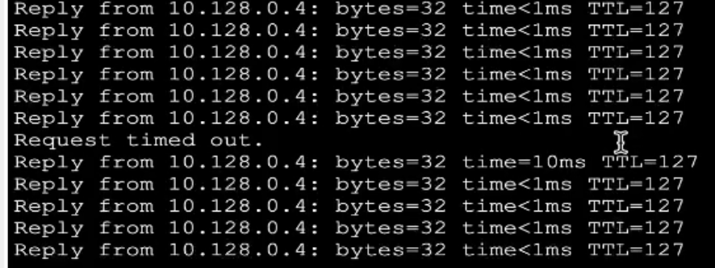

---
## Front matter
title: "Отчёт по лабораторной работе №9"
subtitle: "НПИбд-02-22"
author: "Чесноков Артемий Павлович"

## Generic otions
lang: ru-RU
toc-title: "Содержание"

## Bibliography
bibliography: bib/cite.bib
csl: pandoc/csl/gost-r-7-0-5-2008-numeric.csl

## Pdf output format
toc: true # Table of contents
toc-depth: 2
lof: true # List of figures
lot: true # List of tables
fontsize: 12pt
linestretch: 1.5
papersize: a4
documentclass: scrreprt
## I18n polyglossia
polyglossia-lang:
  name: russian
  options:
	- spelling=modern
	- babelshorthands=true
polyglossia-otherlangs:
  name: english
## I18n babel
babel-lang: russian
babel-otherlangs: english
## Fonts
mainfont: IBM Plex Serif
romanfont: IBM Plex Serif
sansfont: IBM Plex Sans
monofont: IBM Plex Mono
mathfont: STIX Two Math
mainfontoptions: Ligatures=Common,Ligatures=TeX,Scale=0.94
romanfontoptions: Ligatures=Common,Ligatures=TeX,Scale=0.94
sansfontoptions: Ligatures=Common,Ligatures=TeX,Scale=MatchLowercase,Scale=0.94
monofontoptions: Scale=MatchLowercase,Scale=0.94,FakeStretch=0.9
mathfontoptions:
## Biblatex
biblatex: true
biblio-style: "gost-numeric"
biblatexoptions:
  - parentracker=true
  - backend=biber
  - hyperref=auto
  - language=auto
  - autolang=other*
  - citestyle=gost-numeric
## Pandoc-crossref LaTeX customization
figureTitle: "Рис."
tableTitle: "Таблица"
listingTitle: "Листинг"
lofTitle: "Список иллюстраций"
lotTitle: "Список таблиц"
lolTitle: "Листинги"
## Misc options
indent: true
header-includes:
  - \usepackage{indentfirst}
  - \usepackage{float} # keep figures where there are in the text
  - \floatplacement{figure}{H} # keep figures where there are in the text
---

# Цель работы

Изучение возможностей протокола STP и его модификаций по обеспечению
отказоустойчивости сети, агрегированию интерфейсов и перераспределению
нагрузки между ними.

# Выполнение лабораторной работы

Создаем  резервное соединение между коммутаторами msk-donskayasw-1 и msk-donskaya-sw-3  (рис. [-@fig:001]).

{#fig:001 width=70%}

Делаем транковый порты (рис. [-@fig:002]).

{#fig:002 width=70%}

 Соединяем коммутаторы 1 и 4 (рис. [-@fig:003]).

{#fig:003 width=70%}

Конфигурируем порты (рис. [-@fig:004]).

{#fig:004 width=70%}

проверяем работоспособность соединения(рис. [-@fig:005]).

{#fig:005 width=70%}

Отслеживаем только ICMP (рис. [-@fig:006]).

{#fig:006 width=70%}

В симуляции видим как пакет проходит через 2 коммутатор (рис. [-@fig:007]).

{#fig:007 width=70%}

Наблюдаем что в STP протоколе второй коммутатор имеет статус корневого (рис. [-@fig:008]).

{#fig:008 width=70%}

Конфигурируем первый коммутатор (рис. [-@fig:009]).

{#fig:009 width=70%}

В симуляции видим, что от первого коммутатора запрос сразу переходит в 3 (рис. [-@fig:010]).

{#fig:010 width=70%}

Ставим portfast на каждый порт ведущий в сервер (рис. [-@fig:011]) (рис. [-@fig:012]).

{#fig:011 width=70%}

{#fig:012 width=70%}

Будем продолжительное время пинговать mail сервер (рис. [-@fig:013]).

{#fig:013 width=70%}

Отключаем путь по второму гигабитному порту (рис. [-@fig:014]).

{#fig:014 width=70%}

Видим как пинг временно падает на время поиска нового маршрута (рис. [-@fig:015]).

{#fig:015 width=70%}

Обратно поднимаем (рис. [-@fig:016]).

{#fig:016 width=70%}

Так же смотрим пинг (рис. [-@fig:017]).

{#fig:017 width=70%}

Ставим более современную версию, функционального наследника stp (рис. [-@fig:018]).

{#fig:018 width=70%}

Повторям эксперимент с пингом (рис. [-@fig:019]).

{#fig:019 width=70%}

Потери пакетов отсутствуют при опускании маршрута (рис. [-@fig:020]).

{#fig:020 width=70%}

1 пакет теряется при поднятии порта (рис. [-@fig:021]).

{#fig:021 width=70%}

Формируем агрегированное соединение (рис. [-@fig:022]).

{#fig:022 width=70%}

Отключаем транковые порты на обоих коммутаторах  (рис. [-@fig:023]).

{#fig:023 width=70%}

Соединение агрегированных интерфейсов (рис. [-@fig:024]).

{#fig:024 width=70%}

Аналогично для следующего коммутатора (рис. [-@fig:025]).

{#fig:025 width=70%}

# Выводы

Изучили возможности протокола STP и его модификаций по обеспечению
отказоустойчивости сети, агрегированию интерфейсов и перераспределению
нагрузки между ними.

# Список литературы{.unnumbered}

::: {#refs}
:::
