---
## Front matter
lang: ru-RU
title: Защита по лабораторной работе №10
subtitle: pf
author:
  - Чесноков Артемий Павлович
institute:
  - Российский университет дружбы народов, Москва, Россия
date: 15 марта 2025

## i18n babel
babel-lang: russian
babel-otherlangs: english

## Formatting pdf
toc: false
toc-title: Содержание
slide_level: 2
aspectratio: 169
section-titles: true
theme: metropolis
header-includes:
 - \metroset{progressbar=frametitle,sectionpage=progressbar,numbering=fraction}
---

# Информация

## Цель

Освоить настройку прав доступа пользователей к ресурсам сети.

## Подключаем laptop .

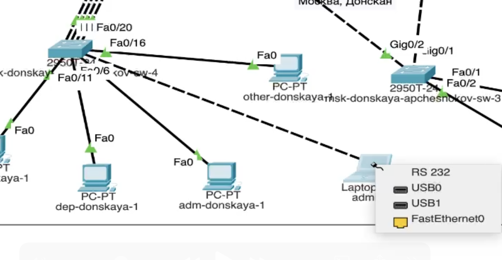

## Выдаем статический адрес  .

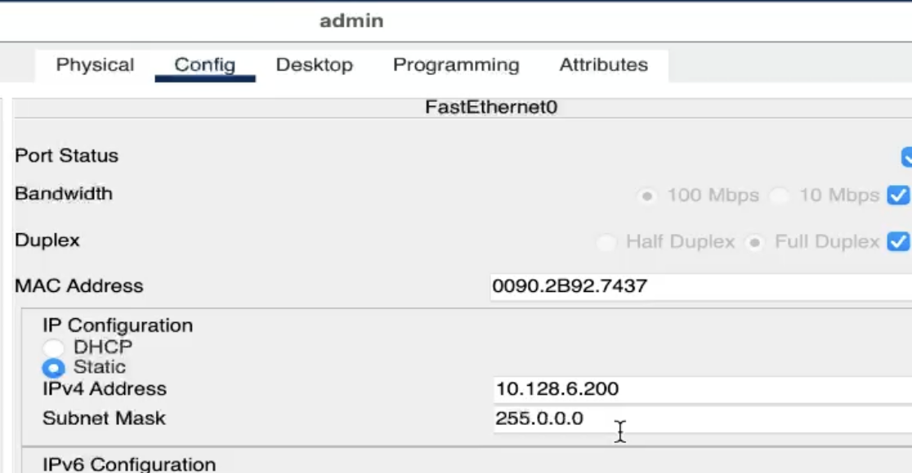

## Даем gateaway и dns адреса  .

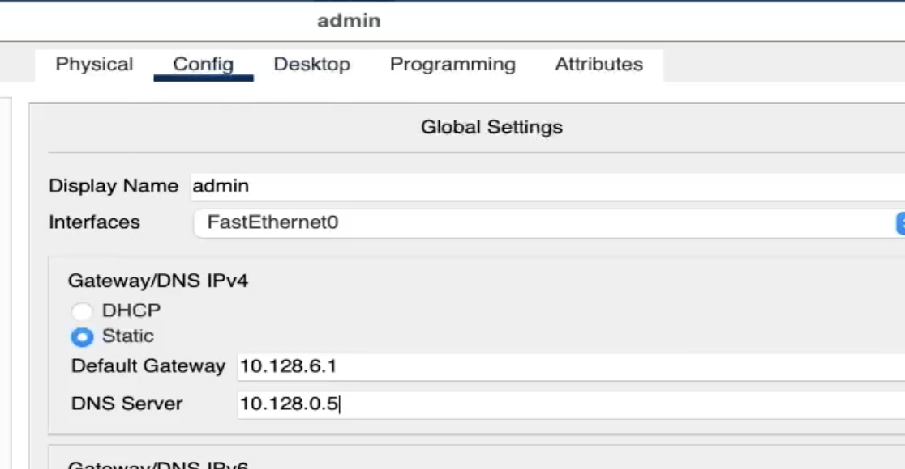

## Разрешаем обращаться к web .

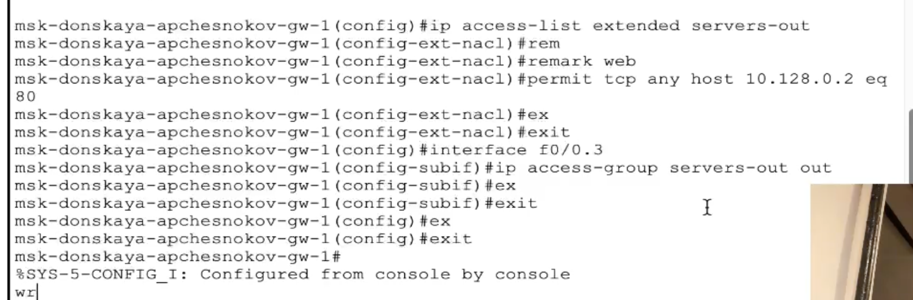

## Пример захода на адрес по ip через устройство .

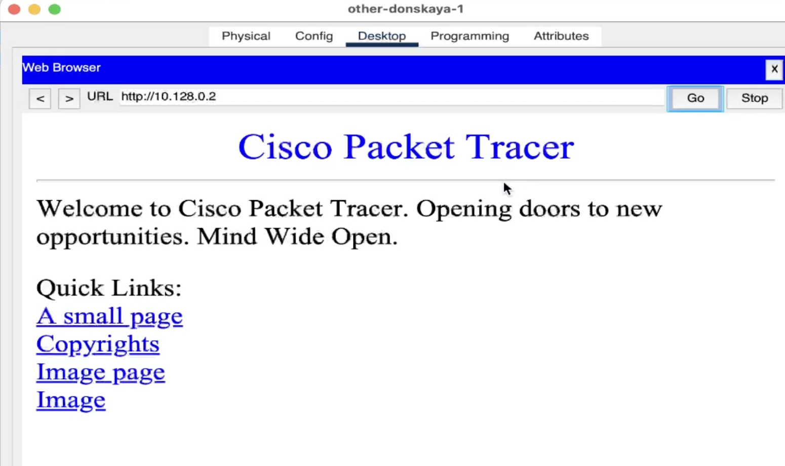

## Разрешаем админу ftp и telnet .

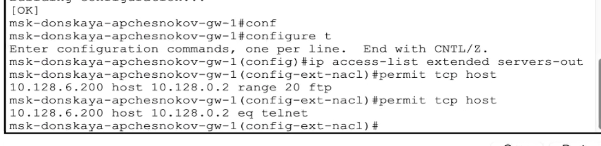

## Пробуем от админа  .

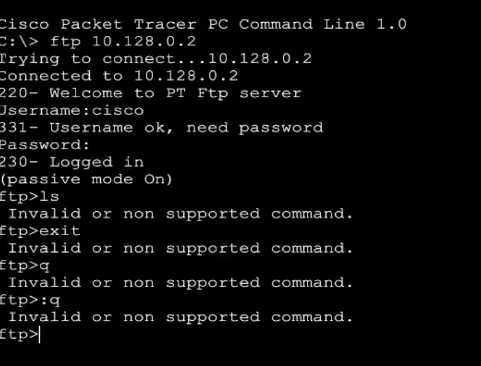

## Пробуем от любого другого пользователя .

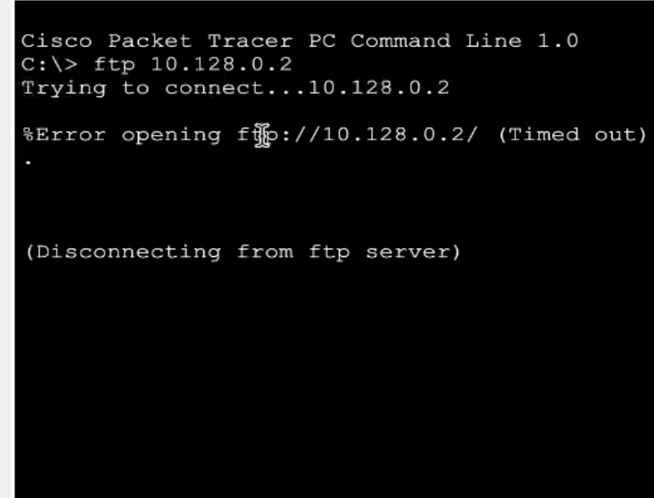

## Делаем доступ на файловый сервер .

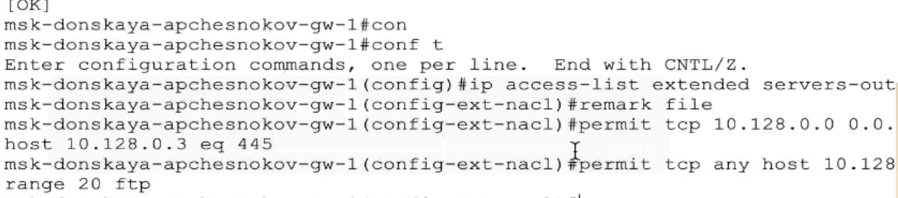

## Настраиваем доступы для mail и dns  .

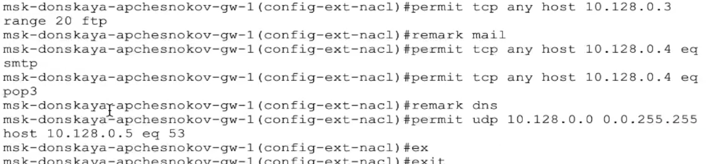

## Заходим по домену с любого устройства  .

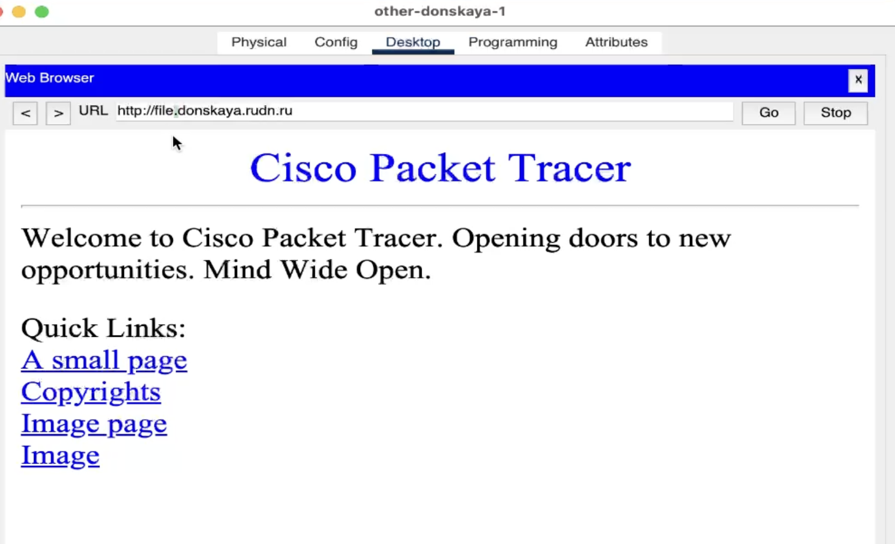

##  Всегда пропускаем icmp через маршрутизатор, всегда разрешаем, откуда угодно и куда угодно  .

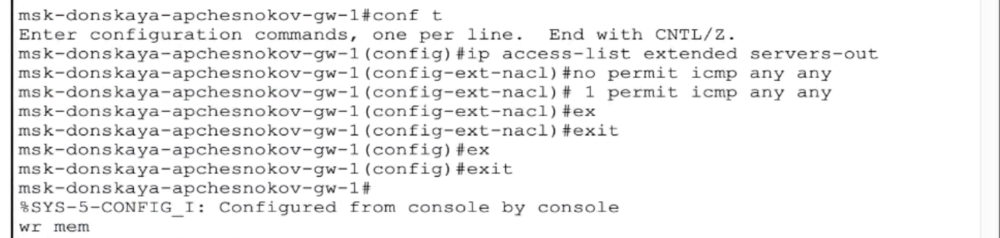

## Даем админу доступ к сетевому оборудованию  .

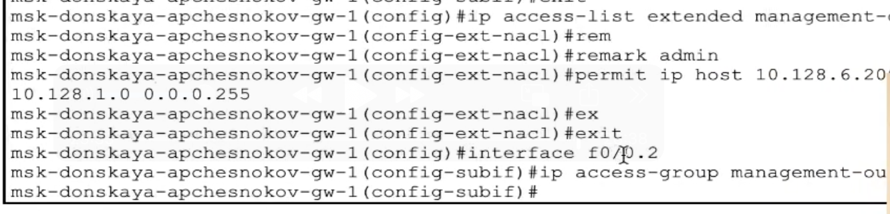

## Спасибо за внимание.
