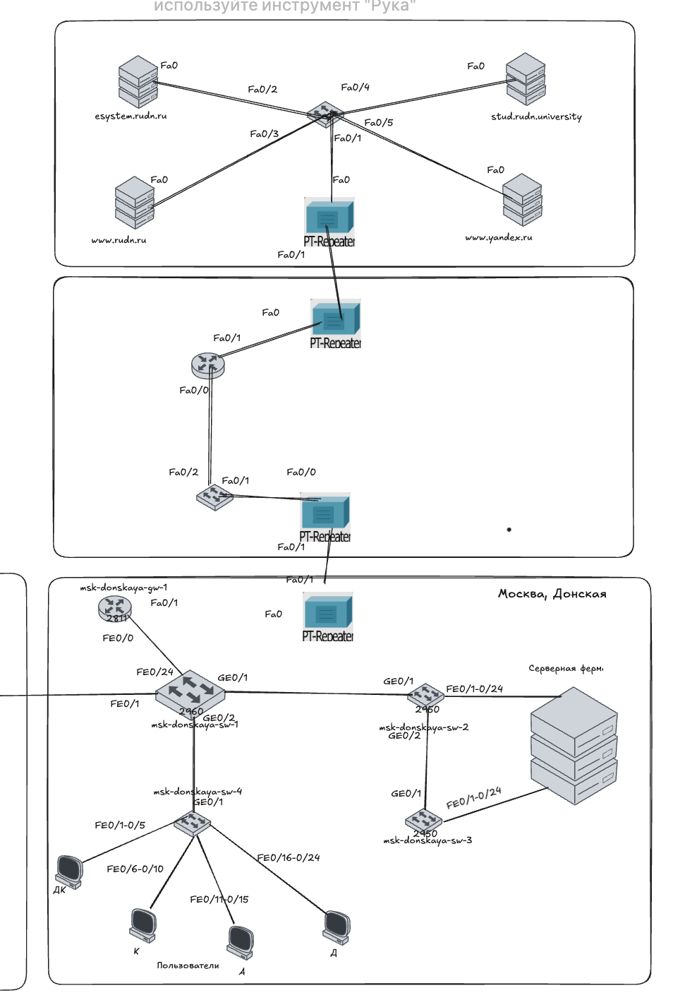
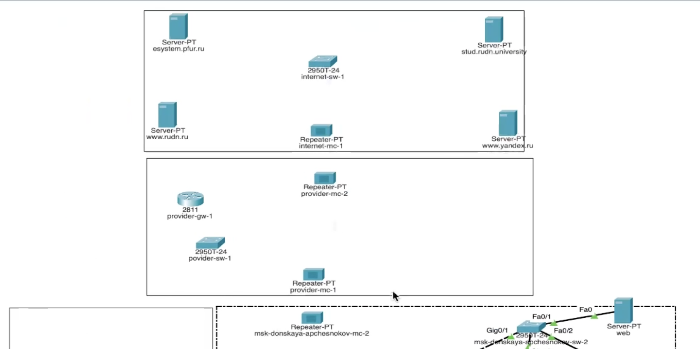
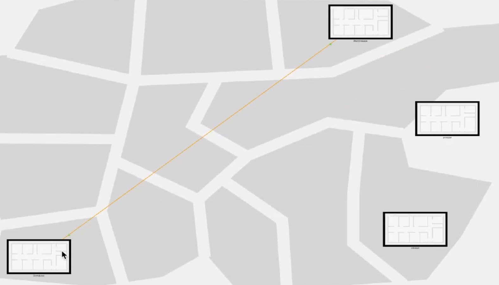
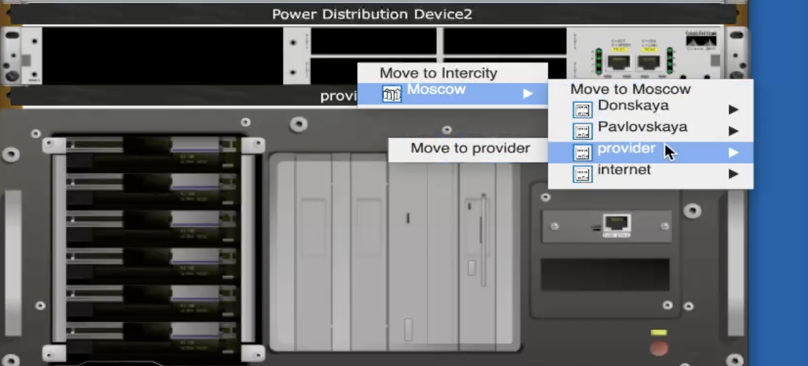
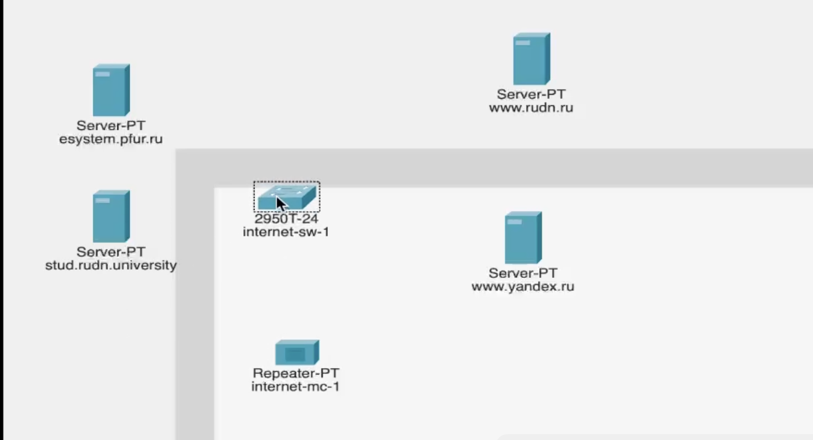
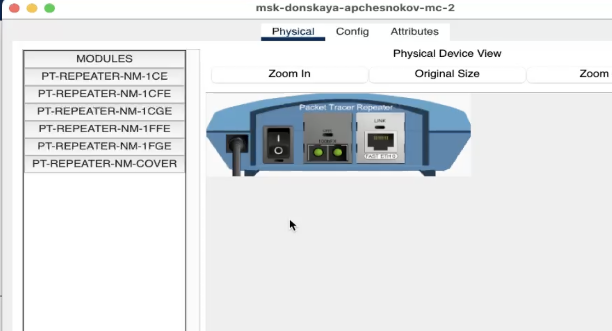
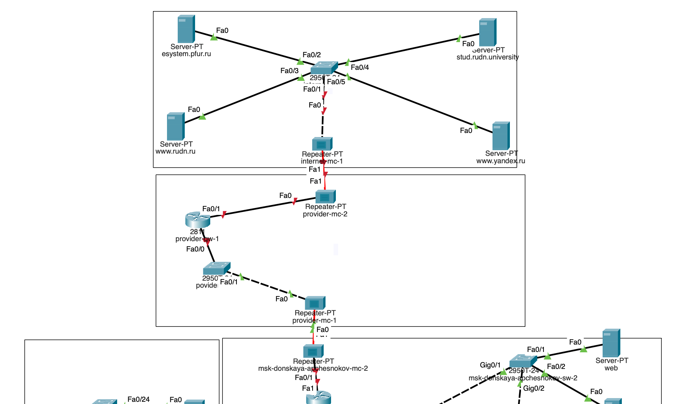
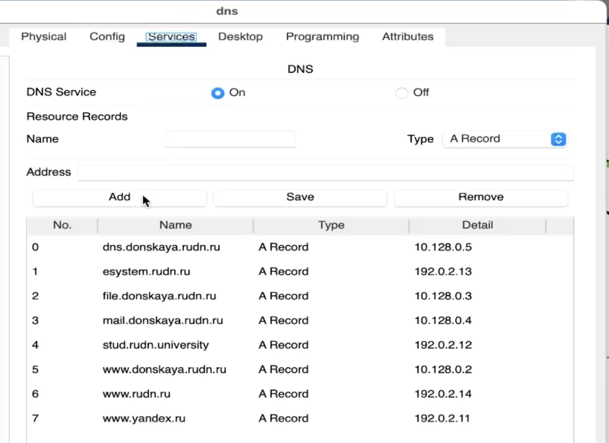
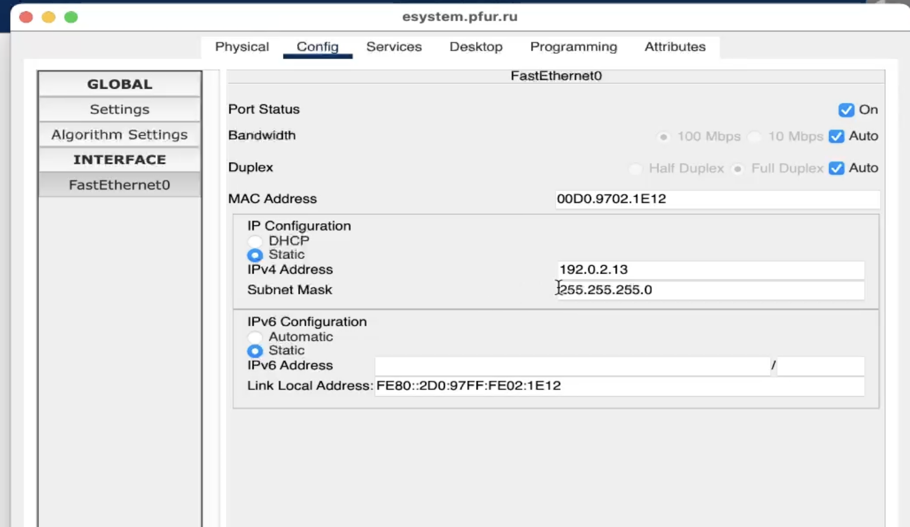

---
## Front matter
lang: ru-RU
title: Защита по лабораторной работе №11
subtitle: student
author:
  - Чесноков Артемий Павлович
institute:
  - Российский университет дружбы народов, Москва, Россия
date: 15 марта 2025

## i18n babel
babel-lang: russian
babel-otherlangs: english

## Formatting pdf
toc: false
toc-title: Содержание
slide_level: 2
aspectratio: 169
section-titles: true
theme: metropolis
header-includes:
 - \metroset{progressbar=frametitle,sectionpage=progressbar,numbering=fraction}
---

# Информация

## Цель

Провести подготовительные мероприятия по подключению локальной сети
организации к Интернету.

## Обновляем нашу L1 схему, которую мы создаем в 3ей лабораторной работе .

## Непосредственно в packetTracer'е размещаем все устройства  .

## В physical view размещаем новые здания: Provider и Internet  .

## Переносим в physical view все устройства на их здания .

## Заменяем модули на повторителях .

## Итоговая схема сети  .

## Настраиваем статические адреса на сервера .

## Добавляем адреса серверов в dns list .

## Спасибо за внимание.
